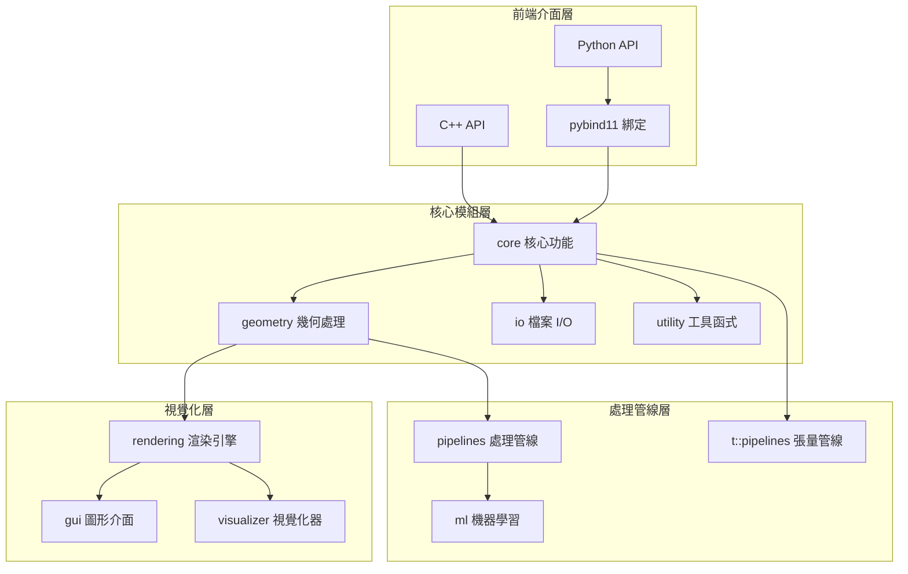
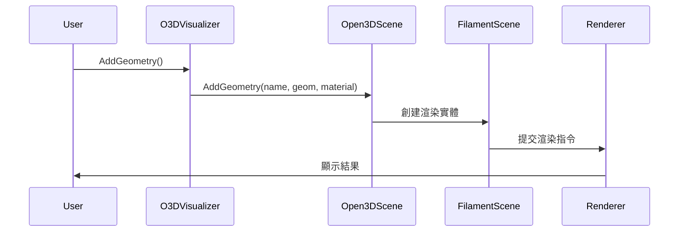

# Open3D_Overview

[TOC]

# DeepWiki Q&A with Code Context for Repository: isl-org/Open3D
## Q1
請說明這專案,回答的輸出請用繁體中文及Markdown格式
### Answer
# Open3D 專案概述

Open3D 是一個開源函式庫，專門用於支援 3D 數據處理軟體的快速開發 Open3D:21-25 。它提供了精心設計的數據結構和演算法，同時支援 C++ 和 Python 介面，後端則高度優化並支援平行化處理 Open3D:6-10 。

## 核心功能

Open3D 的主要功能包括：

- **3D 數據結構**：提供點雲、三角網格、體素網格等幾何數據結構 Open3D:33-34 
- **3D 數據處理演算法**：包含各種 3D 數據處理和操作演算法 Open3D:34-35 
- **場景重建**：支援 3D 場景重建功能 Open3D:35-36 
- **表面對齊**：提供表面對齊和配準功能 Open3D:36-37 
- **3D 視覺化**：強大的 3D 視覺化功能 Open3D:37-38 
- **物理基礎渲染 (PBR)**：支援基於物理的渲染 Open3D:38-39 
- **3D 機器學習**：與 PyTorch 和 TensorFlow 整合 Open3D:39-40 
- **GPU 加速**：核心 3D 操作支援 GPU 加速 Open3D:40-41 

## 支援平台

Open3D 支援多種作業系統和 Python 版本：

**作業系統**：
- Ubuntu 20.04+ 和 22.04 Open3D:41-42 
- Windows 10 64-bit Open3D:42-43 
- macOS High Sierra 及以上版本 Open3D:43-44 

**Python 版本**：
- Python 3.10-3.14 Open3D:47-51 

## 快速開始

### Python 安裝

```bash
# 安裝標準版本
pip install open3d

# 安裝僅 CPU 版本（適用於 x86_64 Linux）
pip install open3d-cpu
``` Open3D:49-52 

### 驗證安裝

```python
import open3d as o3d
print(o3d.__version__)

# 創建並顯示一個球體
mesh = o3d.geometry.TriangleMesh.create_sphere()
mesh.compute_vertex_normals()
o3d.visualization.draw(mesh, raw_mode=True)
``` Open3D:144-151 

### C++ 使用

對於 C++ 開發，可以從 GitHub 發布頁面下載二進制包，或從原始碼編譯 Open3D:183-189 。

## 專案架構

Open3D 採用模組化設計，主要包含：

- **核心模組**：提供基礎數據結構和演算法
- **幾何處理模組**：處理點雲、網格等幾何數據
- **視覺化模組**：提供 3D 視覺化功能
- **I/O 模組**：處理各種 3D 檔案格式的讀寫
- **管線模組**：提供重建、配準等高級功能

## 相關資源

- **官方網站**：[www.open3d.org](https://www.open3d.org) Open3D:56-57 
- **文檔**：[www.open3d.org/docs](https://www.open3d.org/docs) Open3D:58-59 
- **原始碼**：[github.com/isl-org/Open3D](https://github.com/isl-org/Open3D) Open3D:57-58 
- **Open3D-ML**：機器學習擴展模組 Open3D:119-122 

## 授權

Open3D 使用 MIT 授權，歡迎開源社群貢獻 Open3D:59-59 。

---

## Notes

Open3D 是一個功能強大的 3D 數據處理函式庫，適用於各種 3D 應用開發，包括計算機視覺、機器人學、科學計算等領域。它提供了完整的 C++ 和 Python API，以及豐富的範例和文檔，是 3D 數據處理領域的重要工具。

Wiki pages you might want to explore:
- [Documentation & Examples (isl-org/Open3D)](/wiki/isl-org/Open3D#8)
### Citations
**File:** README.md (L21-25)
```markdown
Open3D is an open-source library that supports rapid development of software
that deals with 3D data. The Open3D frontend exposes a set of carefully selected
data structures and algorithms in both C++ and Python. The backend is highly
optimized and is set up for parallelization. We welcome contributions from
the open-source community.
```
**File:** README.md (L33-41)
```markdown
-   3D data structures
-   3D data processing algorithms
-   Scene reconstruction
-   Surface alignment
-   3D visualization
-   Physically based rendering (PBR)
-   3D machine learning support with PyTorch and TensorFlow
-   GPU acceleration for core 3D operations
-   Available in C++ and Python
```
**File:** README.md (L119-122)
```markdown
Open3D-ML is an extension of Open3D for 3D machine learning tasks. It builds on
top of the Open3D core library and extends it with machine learning tools for
3D data processing. To try it out, install Open3D with PyTorch or TensorFlow and check out
[Open3D-ML](https://github.com/isl-org/Open3D-ML).
```
**File:** python/README.rst (L6-10)
```text
Open3D is an open-source library that supports rapid development of software
that deals with 3D data. The Open3D frontend exposes a set of carefully selected
data structures and algorithms in both C++ and Python. The backend is highly
optimized and is set up for parallelization. We welcome contributions from the
open-source community.
```
**File:** python/README.rst (L41-44)
```text
* Ubuntu 20.04 and 22.04
* Windows 10 64-bit
* macOS High Sierra and above

```
**File:** python/README.rst (L47-51)
```text
* 3.10
* 3.11
* 3.12
* 3.13
* 3.14
```
**File:** python/README.rst (L56-59)
```text
* Website: `www.open3d.org <https://www.open3d.org>`_
* Code: `github.com/isl-org/Open3D <https://github.com/isl-org/Open3D>`_
* Documentation: `www.open3d.org/docs <https://www.open3d.org/docs>`_
* License: `The MIT license <https://opensource.org/licenses/MIT>`_
```
**File:** docs/getting_started.in.rst (L49-52)
```text
.. code-block:: bash

    pip install open3d        # or
    pip install open3d-cpu    # Smaller CPU only wheel on x86_64 Linux (since v0.17+)
```
**File:** docs/getting_started.in.rst (L144-151)
```text
    # Verify installation
    python -c "import open3d as o3d; print(o3d.__version__)"

    # Python API
    python -c "import open3d as o3d; \
               mesh = o3d.geometry.TriangleMesh.create_sphere(); \
               mesh.compute_vertex_normals(); \
               o3d.visualization.draw(mesh, raw_mode=True)"
```
**File:** docs/getting_started.in.rst (L183-189)
```text
To get started with using Open3D in your C++ applications, you can download a
binary package archive from `Github releases
<https://github.com/isl-org/Open3D/releases>`__ (since `v0.15`). These binary
package archives contain the Open3D shared library, include headers and GUI /
rendering resources. These are built with all supported features and are
available for the main supported platforms. Also, the latest development version
(``HEAD`` of ``main`` branch) binary package archives are provided here [#]_:
```
## Q2
請說明這專案的程式架構與邏輯, 回答的輸出請用繁體中文及Markdown格式
### Answer
# Open3D 程式架構與邏輯

Open3D 採用模組化架構設計，支援 C++ 和 Python 雙語言介面，後端高度優化並支援平行化處理 Open3D:21-25 。

## 整體架構概覽



## 核心模組結構

### 主要模組組織

Open3D 的核心架構由以下模組組成 Open3D:121-132 ：

- **camera**: 相機參數和軌跡處理
- **core**: 核心數據結構和張量操作
- **data**: 數據集和範例數據
- **geometry**: 3D 幾何數據結構（點雲、網格等）
- **tgeometry**: 基於張量的幾何處理
- **io**: 檔案輸入輸出
- **tio**: 張量 I/O 操作
- **ml**: 機器學習功能
- **pipelines**: 傳統處理管線
- **tpipelines**: 張量處理管線
- **utility**: 工具函式
- **visualization**: 視覺化和渲染

### 模組間依賴關係

從 `Open3D.h.in` 可以看到模組間的包含關係 Open3D:12-151 ：

1. **基礎層**: `core` 模組提供張量、設備、記憶體管理等基礎功能
2. **幾何層**: `geometry` 模組依賴核心層，提供 3D 幾何數據結構
3. **處理層**: `pipelines` 模組實現各種 3D 處理演算法
4. **視覺化層**: `visualization` 模組提供渲染和交互功能

## 視覺化系統架構

### 三層渲染架構

視覺化系統採用三層設計 Open3D:38-97 ：

1. **GUI 層**: `gui::Application`, `gui::Window`, `gui::SceneWidget`
2. **Visualizer 層**: `O3DVisualizer`, `rendering::Open3DScene`
3. **Rendering Backend**: 基於 Filament 的渲染引擎

### 場景管理流程



## 建構系統

### CMake 模組化建構

Open3D 使用 CMake 進行模組化建構 Open3D:121-180 ：

- 每個模組獨立建構為 `add_source_group()`
- 透過 `open3d_link_3rdparty_libraries()` 連結第三方函式庫
- 支援靜態和動態函式庫建構
- 提供標準的 CMake 配置檔案

## Python 綁定架構

### pybind11 整合

Python API 透過 pybind11 實現 Open3D:1-58 ：

- 每個 C++ 模組對應一個 Python 模組
- 支援傳統幾何類型和張量類型
- 提供完整的機器學習管線綁定

## 擴展模組

### Open3D-ML 整合

Open3D-ML 作為機器學習擴展模組 Open3D:119-122 ：

- 建立在核心函式庫之上
- 支援 PyTorch 和 TensorFlow
- 提供專門的 3D 機器學習工具

## 設計原則

1. **模組化**: 每個功能模組獨立，便於維護和擴展
2. **雙語言支援**: C++ 核心實現，Python 便捷介面
3. **高效能**: 後端優化，支援 GPU 加速和平行處理
4. **可擴展**: 支援自定義演算法和渲染器

---

## Notes

Open3D 的架構設計體現了現代 C++ 函式庫的最佳實踐，透過清晰的模組分離和標準化的 API 設計，實現了高效能和易用性的平衡。視覺化系統的三層架構特別值得注意，它將複雜的渲染細節封裝起來，同時保持了足夠的靈活性供高級用戶自定義。

Wiki pages you might want to explore:
- [Visualization & Rendering (isl-org/Open3D)](/wiki/isl-org/Open3D#5)
- [Documentation & Examples (isl-org/Open3D)](/wiki/isl-org/Open3D#8)
### Citations
**File:** README.md (L21-25)
```markdown
Open3D is an open-source library that supports rapid development of software
that deals with 3D data. The Open3D frontend exposes a set of carefully selected
data structures and algorithms in both C++ and Python. The backend is highly
optimized and is set up for parallelization. We welcome contributions from
the open-source community.
```
**File:** README.md (L119-122)
```markdown
Open3D-ML is an extension of Open3D for 3D machine learning tasks. It builds on
top of the Open3D core library and extends it with machine learning tools for
3D data processing. To try it out, install Open3D with PyTorch or TensorFlow and check out
[Open3D-ML](https://github.com/isl-org/Open3D-ML).
```
**File:** cpp/open3d/CMakeLists.txt (L121-180)
```text
add_source_group(camera)
add_source_group(core)
add_source_group(data)
add_source_group(geometry)
add_source_group(tgeometry)
add_source_group(io)
add_source_group(tio)
add_source_group(ml)
add_source_group(pipelines)
add_source_group(tpipelines)
add_source_group(utility)
add_source_group(visualization)

open3d_show_and_abort_on_warning(Open3D)
open3d_set_global_properties(Open3D)
open3d_set_open3d_lib_properties(Open3D)
open3d_link_3rdparty_libraries(Open3D)

# If we are building a STATIC_LIBRARY, hide symbols coming from 3rd party static
# libraries that are not hidden during compilation. Don't propagate beyond
# direct consumers of libOpen3D.a
target_link_options(Open3D INTERFACE
    $<$<STREQUAL:$<TARGET_PROPERTY:Open3D,TYPE>,STATIC_LIBRARY>:$<LINK_ONLY:${OPEN3D_HIDDEN_3RDPARTY_LINK_OPTIONS}>>)

add_library(Open3D::Open3D ALIAS Open3D)

include(CMakePackageConfigHelpers)

# find_package Open3D
configure_package_config_file(Open3DConfig.cmake.in
                              "${PROJECT_BINARY_DIR}${CMAKE_FILES_DIRECTORY}/Open3DConfig.cmake"
                              INSTALL_DESTINATION ${Open3D_INSTALL_CMAKE_DIR}
                              PATH_VARS Open3D_INSTALL_INCLUDE_DIR
                              NO_CHECK_REQUIRED_COMPONENTS_MACRO
)

# find_package Open3D Version
write_basic_package_version_file("${PROJECT_BINARY_DIR}/Open3DConfigVersion.cmake"
                                 VERSION ${PROJECT_VERSION}
                                 COMPATIBILITY ExactVersion)

# Installation
install(TARGETS Open3D EXPORT Open3DTargets
        RUNTIME DESTINATION ${Open3D_INSTALL_BIN_DIR}
        LIBRARY DESTINATION ${Open3D_INSTALL_LIB_DIR}
        ARCHIVE DESTINATION ${Open3D_INSTALL_LIB_DIR}
)

install(DIRECTORY ${CMAKE_CURRENT_SOURCE_DIR}
    DESTINATION ${Open3D_INSTALL_INCLUDE_DIR}
    FILES_MATCHING
        PATTERN "*.h"
        PATTERN "*.cuh"
)

# Install the Open3DConfig.cmake and Open3DConfigVersion.cmake
install(FILES
        "${PROJECT_BINARY_DIR}${CMAKE_FILES_DIRECTORY}/Open3DConfig.cmake"
        "${PROJECT_BINARY_DIR}/Open3DConfigVersion.cmake"
        DESTINATION "${Open3D_INSTALL_CMAKE_DIR}" COMPONENT dev)
```
**File:** cpp/open3d/Open3D.h.in (L12-151)
```text
#include "open3d/camera/PinholeCameraIntrinsic.h"
#include "open3d/camera/PinholeCameraParameters.h"
#include "open3d/camera/PinholeCameraTrajectory.h"
#include "open3d/core/Blob.h"
#include "open3d/core/DLPack.h"
#include "open3d/core/Device.h"
#include "open3d/core/Dtype.h"
#include "open3d/core/EigenConverter.h"
#include "open3d/core/FunctionTraits.h"
#include "open3d/core/MemoryManager.h"
#include "open3d/core/MemoryManagerStatistic.h"
#include "open3d/core/ShapeUtil.h"
#include "open3d/core/SizeVector.h"
#include "open3d/core/Tensor.h"
#include "open3d/core/TensorCheck.h"
#include "open3d/core/TensorKey.h"
#include "open3d/core/TensorList.h"
#include "open3d/core/nns/NearestNeighborSearch.h"
#include "open3d/data/Dataset.h"
#include "open3d/geometry/BoundingVolume.h"
#include "open3d/geometry/Geometry.h"
#include "open3d/geometry/HalfEdgeTriangleMesh.h"
#include "open3d/geometry/Image.h"
#include "open3d/geometry/KDTreeFlann.h"
#include "open3d/geometry/Keypoint.h"
#include "open3d/geometry/Line3D.h"
#include "open3d/geometry/LineSet.h"
#include "open3d/geometry/Octree.h"
#include "open3d/geometry/PointCloud.h"
#include "open3d/geometry/RGBDImage.h"
#include "open3d/geometry/TriangleMesh.h"
#include "open3d/geometry/VoxelGrid.h"
#include "open3d/io/FeatureIO.h"
#include "open3d/io/FileFormatIO.h"
#include "open3d/io/IJsonConvertibleIO.h"
#include "open3d/io/ImageIO.h"
#include "open3d/io/LineSetIO.h"
#include "open3d/io/ModelIO.h"
#include "open3d/io/PinholeCameraTrajectoryIO.h"
#include "open3d/io/PointCloudIO.h"
#include "open3d/io/PoseGraphIO.h"
#include "open3d/io/TriangleMeshIO.h"
#include "open3d/io/VoxelGridIO.h"
#include "open3d/pipelines/color_map/NonRigidOptimizer.h"
#include "open3d/pipelines/color_map/RigidOptimizer.h"
#include "open3d/pipelines/integration/ScalableTSDFVolume.h"
#include "open3d/pipelines/integration/TSDFVolume.h"
#include "open3d/pipelines/integration/UniformTSDFVolume.h"
#include "open3d/pipelines/odometry/Odometry.h"
#include "open3d/pipelines/registration/ColoredICP.h"
#include "open3d/pipelines/registration/FastGlobalRegistration.h"
#include "open3d/pipelines/registration/Feature.h"
#include "open3d/pipelines/registration/GeneralizedICP.h"
#include "open3d/pipelines/registration/GlobalOptimization.h"
#include "open3d/pipelines/registration/Registration.h"
#include "open3d/pipelines/registration/TransformationEstimation.h"
#include "open3d/t/geometry/Geometry.h"
#include "open3d/t/geometry/Image.h"
#include "open3d/t/geometry/PointCloud.h"
#include "open3d/t/geometry/RGBDImage.h"
#include "open3d/t/geometry/TensorMap.h"
#include "open3d/t/geometry/TriangleMesh.h"
#include "open3d/t/geometry/VoxelBlockGrid.h"
#include "open3d/t/io/HashMapIO.h"
#include "open3d/t/io/ImageIO.h"
#include "open3d/t/io/NumpyIO.h"
#include "open3d/t/io/PointCloudIO.h"
#include "open3d/t/pipelines/kernel/TransformationConverter.h"
#include "open3d/t/pipelines/odometry/RGBDOdometry.h"
#include "open3d/t/pipelines/registration/Registration.h"
#include "open3d/t/pipelines/registration/TransformationEstimation.h"
#include "open3d/t/pipelines/slac/ControlGrid.h"
#include "open3d/t/pipelines/slac/SLACOptimizer.h"
#include "open3d/t/pipelines/slam/Frame.h"
#include "open3d/t/pipelines/slam/Model.h"
#include "open3d/utility/CPUInfo.h"
#include "open3d/utility/CompilerInfo.h"
#include "open3d/utility/Console.h"
#include "open3d/utility/Eigen.h"
#include "open3d/utility/FileSystem.h"
#include "open3d/utility/Helper.h"
#include "open3d/utility/ISAInfo.h"
#include "open3d/utility/Logging.h"
#include "open3d/utility/Parallel.h"
#include "open3d/utility/ProgressBar.h"
#include "open3d/utility/ProgressReporters.h"
#include "open3d/utility/Random.h"
#include "open3d/utility/Timer.h"
#include "open3d/visualization/gui/Application.h"
#include "open3d/visualization/gui/Button.h"
#include "open3d/visualization/gui/Checkbox.h"
#include "open3d/visualization/gui/Color.h"
#include "open3d/visualization/gui/Combobox.h"
#include "open3d/visualization/gui/Dialog.h"
#include "open3d/visualization/gui/Gui.h"
#include "open3d/visualization/gui/ImageWidget.h"
#include "open3d/visualization/gui/Label.h"
#include "open3d/visualization/gui/Layout.h"
#include "open3d/visualization/gui/Menu.h"
#include "open3d/visualization/gui/ProgressBar.h"
#include "open3d/visualization/gui/SceneWidget.h"
#include "open3d/visualization/gui/Slider.h"
#include "open3d/visualization/gui/TabControl.h"
#include "open3d/visualization/gui/TextEdit.h"
#include "open3d/visualization/gui/Theme.h"
#include "open3d/visualization/gui/ToggleSwitch.h"
#include "open3d/visualization/gui/TreeView.h"
#include "open3d/visualization/gui/Window.h"
#include "open3d/visualization/rendering/Material.h"
#include "open3d/visualization/rendering/Model.h"
#include "open3d/visualization/rendering/Open3DScene.h"
#include "open3d/visualization/utility/Draw.h"
#include "open3d/visualization/utility/DrawGeometry.h"
#include "open3d/visualization/utility/SelectionPolygon.h"
#include "open3d/visualization/utility/SelectionPolygonVolume.h"
#include "open3d/visualization/visualizer/O3DVisualizer.h"
#include "open3d/visualization/visualizer/ViewControl.h"
#include "open3d/visualization/visualizer/ViewControlWithCustomAnimation.h"
#include "open3d/visualization/visualizer/ViewControlWithEditing.h"
#include "open3d/visualization/visualizer/Visualizer.h"
#include "open3d/visualization/visualizer/VisualizerWithCustomAnimation.h"
#include "open3d/visualization/visualizer/VisualizerWithEditing.h"
#include "open3d/visualization/visualizer/VisualizerWithKeyCallback.h"
#include "open3d/visualization/visualizer/VisualizerWithVertexSelection.h"

// clang-format off
@BUILD_AZURE_KINECT_COMMENT@#include "open3d/io/sensor/azure_kinect/AzureKinectRecorder.h"
@BUILD_AZURE_KINECT_COMMENT@#include "open3d/io/sensor/azure_kinect/AzureKinectSensorConfig.h"
@BUILD_AZURE_KINECT_COMMENT@#include "open3d/io/sensor/azure_kinect/AzureKinectSensor.h"
@BUILD_AZURE_KINECT_COMMENT@#include "open3d/io/sensor/azure_kinect/MKVMetadata.h"
@BUILD_AZURE_KINECT_COMMENT@#include "open3d/io/sensor/azure_kinect/MKVReader.h"
@BUILD_AZURE_KINECT_COMMENT@#include "open3d/io/sensor/azure_kinect/MKVWriter.h"
@BUILD_AZURE_KINECT_COMMENT@#include "open3d/io/sensor/RGBDRecorder.h"
@BUILD_AZURE_KINECT_COMMENT@#include "open3d/io/sensor/RGBDSensorConfig.h"
@BUILD_AZURE_KINECT_COMMENT@#include "open3d/io/sensor/RGBDSensor.h"

@BUILD_LIBREALSENSE_COMMENT@#include "open3d/t/io/sensor/realsense/RSBagReader.h"
@BUILD_LIBREALSENSE_COMMENT@#include "open3d/t/io/sensor/realsense/RealSenseSensor.h"

@BUILD_WEBRTC_COMMENT@#include "open3d/visualization/webrtc_server/WebRTCWindowSystem.h"
```
**File:** cpp/open3d/visualization/rendering/Open3DScene.h (L38-97)
```text
class Open3DScene {
public:
    Open3DScene(Renderer& renderer);
    ~Open3DScene();

    View* GetView() const;
    ViewHandle GetViewId() const { return view_; }
    void SetViewport(std::int32_t x,
                     std::int32_t y,
                     std::uint32_t width,
                     std::uint32_t height);

    void ShowSkybox(bool enable);
    void ShowAxes(bool enable);
    void SetBackground(const Eigen::Vector4f& color,
                       std::shared_ptr<geometry::Image> image = nullptr);
    const Eigen::Vector4f GetBackgroundColor() const;
    void ShowGroundPlane(bool enable, Scene::GroundPlane plane);

    enum class LightingProfile {
        HARD_SHADOWS,
        DARK_SHADOWS,
        MED_SHADOWS,
        SOFT_SHADOWS,
        NO_SHADOWS
    };

    void SetLighting(LightingProfile profile, const Eigen::Vector3f& sun_dir);

    /// Sets the maximum number of points before AddGeometry also adds a
    /// downsampled point cloud with number of points, used when rendering
    /// speed is important.
    void SetDownsampleThreshold(size_t n_points) {
        downsample_threshold_ = n_points;
    }
    size_t GetDownsampleThreshold() const { return downsample_threshold_; }

    void ClearGeometry();
    /// Adds a geometry with the specified name. Default visible is true.
    void AddGeometry(const std::string& name,
                     const geometry::Geometry3D* geom,
                     const MaterialRecord& mat,
                     bool add_downsampled_copy_for_fast_rendering = true);
    // Note: we can't use shared_ptr here, as we might be given something
    //       from Python, which is using unique_ptr. The pointer must live long
    //       enough to get copied to the GPU by the render thread.
    void AddGeometry(const std::string& name,
                     const t::geometry::Geometry* geom,
                     const MaterialRecord& mat,
                     bool add_downsampled_copy_for_fast_rendering = true);
    bool HasGeometry(const std::string& name) const;
    void RemoveGeometry(const std::string& name);
    /// Shows or hides the geometry with the specified name.
    void ShowGeometry(const std::string& name, bool show);
    bool GeometryIsVisible(const std::string& name);
    void SetGeometryTransform(const std::string& name,
                              const Eigen::Matrix4d& transform);
    Eigen::Matrix4d GetGeometryTransform(const std::string& name);

    void ModifyGeometryMaterial(const std::string& name,
```
**File:** docs/documented_modules.txt (L1-58)
```text
# Parsed by make_docs.py
open3d.camera
open3d.core
open3d.core.nns
open3d.data
open3d.geometry
open3d.io
open3d.io.rpc
open3d.t
open3d.t.geometry
open3d.t.io
open3d.t.pipelines
open3d.t.pipelines.odometry
open3d.t.pipelines.registration
open3d.t.pipelines.slac
open3d.t.pipelines.slam
open3d.ml
open3d.ml.tf
open3d.ml.tf.layers
open3d.ml.tf.ops
open3d.ml.tf.datasets
open3d.ml.tf.datasets.utils
open3d.ml.tf.datasets.augment
open3d.ml.tf.utils
open3d.ml.tf.vis
open3d.ml.tf.dataloaders
open3d.ml.tf.models
open3d.ml.tf.modules
open3d.ml.tf.modules.losses
open3d.ml.tf.modules.metrics
open3d.ml.tf.pipelines
open3d.ml.torch
open3d.ml.torch.layers
open3d.ml.torch.ops
open3d.ml.torch.classes
open3d.ml.torch.datasets
open3d.ml.torch.datasets.utils
open3d.ml.torch.datasets.augment
open3d.ml.torch.datasets.samplers
open3d.ml.torch.utils
open3d.ml.torch.vis
open3d.ml.torch.dataloaders
open3d.ml.torch.models
open3d.ml.torch.modules
open3d.ml.torch.modules.losses
open3d.ml.torch.modules.metrics
open3d.ml.torch.pipelines
open3d.pipelines
open3d.pipelines.color_map
open3d.pipelines.integration
open3d.pipelines.odometry
open3d.pipelines.registration
open3d.utility
open3d.visualization
open3d.visualization.gui
open3d.visualization.rendering
open3d.visualization.webrtc_server
open3d.visualization.tensorboard_plugin.summary
```
## Q3
如何列出支援的GPU 型號 ,本地 GPU 能力, 內存及功耗,頻寬, 並給出如何監控的範例, 回答的輸出請用繁體中文及Markdown格式
### Answer
# Open3D GPU 設備檢測與監控

Open3D 提供了完整的 GPU 設備檢測和監控功能，支援 CUDA 和 SYCL 兩種主要後端。

## 列出支援的 GPU 型號

### CUDA 設備檢測

```python
import open3d as o3d

# 檢查 CUDA 可用性
if o3d.core.cuda.is_available():
    print(f"CUDA 設備數量: {o3d.core.cuda.device_count()}")
    # 列出所有 CUDA 設備
    for i in range(o3d.core.cuda.device_count()):
        device = o3d.core.Device(f"CUDA:{i}")
        print(f"設備 {i}: {device}")
else:
    print("CUDA 不可用")
``` Open3D:21-26 

### SYCL 設備檢測

```python
import open3d as o3d

# 列出所有可用的 SYCL 設備
devices = o3d.core.sycl.get_available_devices()
print("可用的 SYCL 設備:")
for device in devices:
    print(f"  {device}")

# 打印詳細的 SYCL 設備信息
o3d.core.sycl.print_sycl_devices(print_all=True)
``` Open3D:28-35 

## 獲取 GPU 能力和內存信息

### CUDA 設備能力

```python
import open3d as o3d

if o3d.core.cuda.is_available():
    # 獲取當前設備的總內存
    # 注意：這需要調用 C++ 層的函數
    print("CUDA 設備信息:")
    print(f"  設備數量: {o3d.core.cuda.device_count()}")
    
    # 創建張量來測試設備能力
    device = o3d.core.Device("CUDA:0")
    try:
        # 測試內存分配能力
        test_tensor = o3d.core.Tensor.zeros([1000, 1000], o3d.core.Float32, device)
        print(f"  內存分配: 成功")
        print(f"  設備類型: {device.get_type()}")
        print(f"  設備 ID: {device.get_id()}")
    except Exception as e:
        print(f"  內存分配失敗: {e}")
``` Open3D:290-295 

### SYCL 設備能力

```python
import open3d as o3d

# 檢查 SYCL 設備類型
devices = o3d.core.sycl.get_available_devices()
for device in devices:
    device_type = o3d.core.sycl.get_device_type(device)
    print(f"設備 {device}: 類型 = {device_type}")
    
    # 檢查設備是否可用
    if o3d.core.sycl.is_available(device):
        print(f"  狀態: 可用")
    else:
        print(f"  狀態: 不可用")
``` Open3D:42-45 

## 完整的設備監控範例

```python
import open3d as o3d
import time

def monitor_gpu_devices():
    """監控所有可用的 GPU 設備"""
    print("=== Open3D GPU 設備監控 ===")
    
    # 檢查 CPU 設備（總是可用）
    cpu_device = o3d.core.Device("CPU:0")
    print(f"CPU 設備: {cpu_device}")
    
    # 檢查 CUDA 設備
    if o3d.core.cuda.is_available():
        print(f"\n--- CUDA 設備 ---")
        cuda_count = o3d.core.cuda.device_count()
        print(f"CUDA 設備數量: {cuda_count}")
        
        for i in range(cuda_count):
            device = o3d.core.Device(f"CUDA:{i}")
            print(f"  CUDA:{i} - {device}")
            
            # 測試設備響應
            try:
                start_time = time.time()
                test_tensor = o3d.core.Tensor.ones([100, 100], o3d.core.Float32, device)
                result = test_tensor.sum()
                end_time = time.time()
                print(f"    響應時間: {(end_time - start_time)*1000:.2f}ms")
            except Exception as e:
                print(f"    測試失敗: {e}")
    else:
        print("\n--- CUDA 設備 ---")
        print("CUDA 不可用")
    
    # 檢查 SYCL 設備
    print(f"\n--- SYCL 設備 ---")
    try:
        sycl_devices = o3d.core.sycl.get_available_devices()
        print(f"SYCL 設備數量: {len(sycl_devices)}")
        
        for device in sycl_devices:
            device_type = o3d.core.sycl.get_device_type(device)
            print(f"  {device} - 類型: {device_type}")
            
            # 測試設備響應
            try:
                start_time = time.time()
                test_tensor = o3d.core.Tensor.ones([100, 100], o3d.core.Float32, device)
                result = test_tensor.sum()
                end_time = time.time()
                print(f"    響應時間: {(end_time - start_time)*1000:.2f}ms")
            except Exception as e:
                print(f"    測試失敗: {e}")
                
    except Exception as e:
        print(f"SYCL 檢測失敗: {e}")

def list_all_devices():
    """列出所有可用設備的簡化版本"""
    devices = [o3d.core.Device("CPU:0")]
    
    if o3d.core.cuda.device_count() > 0:
        devices.append(o3d.core.Device("CUDA:0"))
    
    # 檢查 SYCL 設備（排除 CPU 後備設備）
    sycl_devices = o3d.core.sycl.get_available_devices()
    if len(sycl_devices) > 1:
        devices.append(o3d.core.Device("SYCL:0"))
    
    return devices

# 使用範例
if __name__ == "__main__":
    # 執行完整監控
    monitor_gpu_devices()
    
    # 簡單設備列表
    print(f"\n=== 可用設備列表 ===")
    all_devices = list_all_devices()
    for device in all_devices:
        print(f"  {device}")
``` Open3D:18-33 

## 系統級 GPU 信息檢測

對於更詳細的 GPU 信息（如功耗、頻寬），Open3D 本身不直接提供這些 API，但可以透過系統命令獲取：

```python
import subprocess
import open3d as o3d

def get_nvidia_gpu_info():
    """獲取 NVIDIA GPU 的詳細信息"""
    try:
        # 使用 nvidia-smi 獲取 GPU 信息
        result = subprocess.run(['nvidia-smi', '--query-gpu=name,memory.total,memory.used,power.draw,utilization.gpu', '--format=csv,noheader,nounits'], 
                              capture_output=True, text=True)
        if result.returncode == 0:
            lines = result.stdout.strip().split('\n')
            print("NVIDIA GPU 信息:")
            for i, line in enumerate(lines):
                parts = line.split(', ')
                print(f"  GPU {i}:")
                print(f"    型號: {parts[0]}")
                print(f"    總內存: {parts[1]} MB")
                print(f"    已用內存: {parts[2]} MB")
                print(f"    功耗: {parts[3]} W")
                print(f"    利用率: {parts[4]}%")
        else:
            print("無法獲取 NVIDIA GPU 信息")
    except FileNotFoundError:
        print("nvidia-smi 未找到，可能未安裝 NVIDIA 驅動")

def get_sycl_gpu_info():
    """獲取 SYCL GPU 信息"""
    try:
        result = subprocess.run(['sycl-ls'], capture_output=True, text=True)
        if result.returncode == 0:
            print("SYCL 設備信息:")
            print(result.stdout)
        else:
            print("無法獲取 SYCL 設備信息")
    except FileNotFoundError:
        print("sycl-ls 未找到，可能未安裝 SYCL 運行時")

# 綜合檢測
def comprehensive_gpu_monitoring():
    print("=== 綜合 GPU 監控 ===")
    
    # Open3D 設備檢測
    print("\n1. Open3D 設備檢測:")
    monitor_gpu_devices()
    
    # 系統級 GPU 信息
    print("\n2. 系統級 GPU 信息:")
    get_nvidia_gpu_info()
    get_sycl_gpu_info()

if __name__ == "__main__":
    comprehensive_gpu_monitoring()
``` Open3D:95-99 

## 注意事項

1. **功耗和頻寬限制**: Open3D 主要專注於 3D 數據處理，不直接提供 GPU 功耗和頻寬監控 API。需要依賴系統工具如 `nvidia-smi`。

2. **設備兼容性**: SYCL 支援多種 GPU 廠商（Intel、AMD、NVIDIA），但功能可能因驅動而異 Open3D:6-9 。

3. **內存管理**: Open3D 提供了 `cuda::ReleaseCache()` 函數來釋放 CUDA 內存緩存，可用於調試 Open3D:27-29 。

4. **設備選擇**: Open3D 會自動選擇最佳 GPU 設備，也可以透過環境變數手動指定 Open3D:86-90 。

---

## Notes

Open3D 的 GPU 監控功能主要集中在設備檢測和基本能力測試上。對於詳細的硬體監控（功耗、頻寬、溫度等），需要結合系統級工具。Open3D 的設備抽象層設計良好，支援 CUDA 和ormal;SYCL 兩種主要後端，為跨平台 GPU 計算提供了統一的介面。

Wiki pages you might want to explore:
- [Open3D Overview (isl-org/Open3D)](/wiki/isl-org/Open3D#1)
### Citations
**File:** cpp/pybind/core/cuda_utils.cpp (L21-26)
```cpp
    m_cuda.def("device_count", cuda::DeviceCount,
               "Returns the number of available CUDA devices. Returns 0 if "
               "Open3D is not compiled with CUDA support.");
    m_cuda.def("is_available", cuda::IsAvailable,
               "Returns true if Open3D is compiled with CUDA support and at "
               "least one compatible CUDA device is detected.");
```
**File:** cpp/pybind/core/cuda_utils.cpp (L27-29)
```cpp
    m_cuda.def("release_cache", cuda::ReleaseCache,
               "Releases CUDA memory manager cache. This is typically used for "
               "debugging.");
```
**File:** cpp/pybind/core/sycl_utils.cpp (L28-35)
```cpp
    m_sycl.def("get_available_devices", sy::GetAvailableSYCLDevices,
               "Return a list of available SYCL devices.");

    m_sycl.def("print_sycl_devices", sy::PrintSYCLDevices,
               "print_all"_a = false,
               "Print SYCL device available to Open3D (either the best "
               "available GPU, or a fallback CPU device).  If `print_all` is "
               "specified, also print SYCL devices of other types.");
```
**File:** cpp/pybind/core/sycl_utils.cpp (L42-45)
```cpp
    m_sycl.def("get_device_type", sy::GetDeviceType, "device"_a,
               "Returns the device type (cpu / gpu / accelerator / custom) of "
               "the specified device as a string. Returns empty string if the "
               "device is not available.");
```
**File:** cpp/open3d/core/CUDAUtils.cpp (L290-295)
```cpp
size_t GetCUDACurrentTotalMemSize() {
    size_t free;
    size_t total;
    OPEN3D_CUDA_CHECK(cudaMemGetInfo(&free, &total));
    return total;
}
```
**File:** python/test/open3d_test.py (L18-33)
```python
def list_devices(enable_cuda=True, enable_sycl=False):
    """
    Returns a list of devices that are available for Open3D to use:
    - Device("CPU:0")
    - Device("CUDA:0") if built with CUDA support and a CUDA device is available.
    - Device("SYCL:0") if built with SYCL support and a SYCL GPU device is available.
    """
    import open3d as o3d

    devices = [o3d.core.Device("CPU:0")]
    if enable_cuda and o3d.core.cuda.device_count() > 0:
        devices.append(o3d.core.Device("CUDA:0"))
    # Ignore fallback SYCL CPU device
    if enable_sycl and len(o3d.core.sycl.get_available_devices()) > 1:
        devices.append(o3d.core.Device("SYCL:0"))
    return devices
```
**File:** docs/sycl.rst (L6-9)
```text
From v0.19, Open3D provides an experimental SYCL backend for cross-platform GPU
support. This backend allows Open3D operations to run on many different GPUs,
including integrated GPUs and discrete GPUs from Intel, Nvidia and AMD. We
provide pre-built C++ binaries and Python wheels for Linux (Ubuntu 22.04+).
```
**File:** docs/sycl.rst (L86-90)
```text
For multi-GPU systems (e.g. with both integrated and discrete GPUs), the more
powerful GPU is automatically selected, as long as the correct GPU drivers and
SYCL runtime are installed. You can select a specific device with the
`ONEAPI_DEVICE_FILTER` or `SYCL_DEVICE_ALLOWLIST`  `environment variables
<https://intel.github.io/llvm/EnvironmentVariables.html>`_.
```
**File:** docs/sycl.rst (L95-99)
```text
    # Print all available devices (command line):
    sycl-ls
    # Examples:
    export ONEAPI_DEVICE_SELECTOR="opencl:1"    # Select the 2nd OpenCL device

```
## Q4
請說明如何使用這專案 及安裝後的使用步驟 本專案有不同的典型使用情境的範例. 回答的輸出請用繁體中文及Markdown格式
### Answer
Wiki pages you might want to explore:
- [Open3D Overview (isl-org/Open3D)](/wiki/isl-org/Open3D#1)
