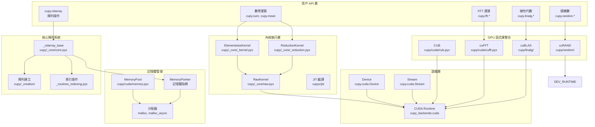
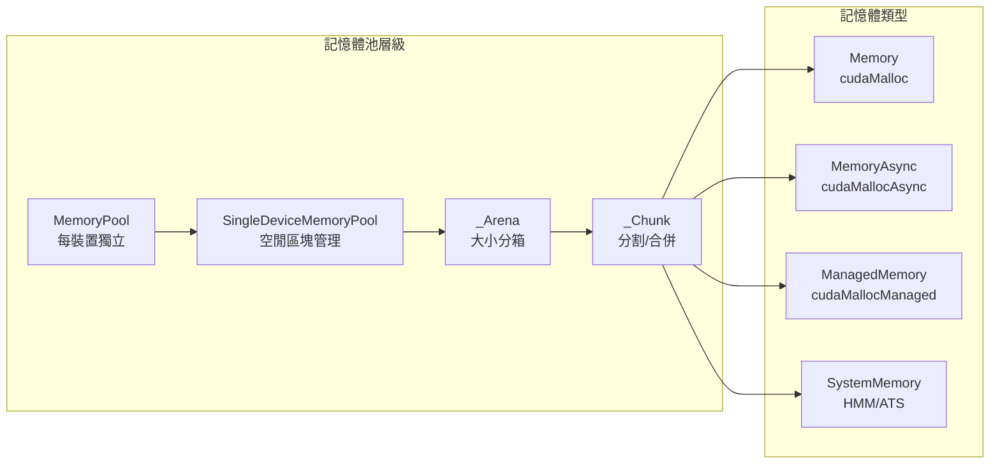

# cupy/cupy

[TOC]

## 請說明這專案,回答的輸出請用繁體中文及Markdown格式

# CuPy 專案概述

CuPy 是一個 NumPy/SciPy 相容的陣列庫，專為 GPU 加速計算而設計，提供 Python 環境下的高效能運算能力 cupy:8-10 。

## 核心特性

- **NumPy 相容的 ndarray**：提供 `cupy.ndarray` 類別，支援熟悉的陣列建立、索引和操作 API
- **GPU 記憶體管理**：實現高效的記憶體池和分配策略
- **內核編譯與執行**：自動生成和快取 CUDA/HIP 內核
- **GPU 函式庫整合**：包裝 cuFFT、cuRAND、cuBLAS、cuSPARSE、CUB 等廠商函式庫
- **零拷貝互通性**：支援 `__cuda_array_interface__` 和 DLPack 協定

## 架構設計

CuPy 採用分層架構，主要包含：

### 用戶 API 層
提供 `cupy.ndarray`、數學運算、隨機數生成、FFT 和 CUDA 介面等高階 API cupy:88-90 。

### 核心陣列系統
實作 `_ndarray_base` 類別（位於 `cupy/_core/core.pyx`），負責 GPU 記憶體指標、形狀、步幅和資料類型的管理。

### 內核執行層
包含 ElementwiseKernel、ReductionKernel 和 RawKernel，負責 CUDA 程式碼生成、編譯和執行。

### 記憶體管理系統
實現複雜的記憶體池系統，避免重複的 `cudaMalloc`/`cudaFree` 呼叫，支援大小分箱、LRU 快取和區塊分割/合併策略。

## 開發與版本控制

CuPy 遵循語義化版本控制，版本號格式為 `X.Y.Zw`，其中 X 為主要版本，Y 為次要版本，Z 為修訂號，w 為可選的發布前綴 cupy:34-36 。

### Git 分支策略
- `main` 分支用於開發發布前版本（alpha、beta、RC）
- 穩定版本在 `vN` 分支開發（如 `v1` 分支對應 v1.x.x 版本）
- 貢獻者通常應將 PR 發送到 `main` 分支 cupy:84-96 

## 相容性政策

CuPy 的更新分為三個層級：
- **主要更新**：包含破壞向後相容性的變更
- **次要更新**：新增和擴展 API，保持向後相容性
- **修訂更新**：改進 API 實作，不改變 API 規格 cupy:16-21 

## 安裝與建置

CuPy 支援多種安裝方式：
- **PyPI wheels**：預建二元檔（`cupy-cuda11x`、`cupy-cuda12x`、`cupy-cuda13x`）
- **Conda 套件**：透過 conda-forge 頻道提供
- **原始碼安裝**：從 GitHub 建置自訂配置

建置系統使用 setuptools 和 Cython，需要 Python 3.10 或更新版本 cupy:31-31 。

## 效能最佳化

CuPy 提供多種效能最佳化功能：
- **內核快取**：編譯後的內核快取在 `~/.cupy/kernel_cache` 目錄
- **CUB/cuTENSOR 後端**：為歸約和其他常式提供加速
- **記憶體池**：減少記憶體分配開銷
- **串流有序記憶體**：使用 CUDA 11.2+ 的串流有序分配器

## 測試與品質保證

CuPy 具有全面的測試基礎設施：
- CI 矩陣：50+ 種配置，橫跨 CUDA/Python 版本
- 測試框架：`cupy.testing` 模組，包含 NumPy 一致性檢查
- Docker 映像檔：用於開發和部署的官方容器

---

## Notes

CuPy 是由 Preferred Networks 和 Preferred Infrastructure 開發的開源專案，採 MIT 授權 cupy:89-91 。專案活躍於 GitHub，歡迎社群貢獻，包括問題回報、程式碼提交和文件改進。對於開發者，建議使用可編輯模式安裝（`pip install --no-build-isolation -e .`）以方便開發和測試 cupy:426-433 。

Wiki pages you might want to explore:
- [Overview (cupy/cupy)](/wiki/cupy/cupy#1)
### Citations
**File:** pyproject.toml (L8-10)
```text
name = "cupy"
description = "CuPy: NumPy & SciPy for GPU"
authors = [{ name = "Seiya Tokui", email = "tokui@preferred.jp" }]
```
**File:** pyproject.toml (L31-31)
```text
requires-python = ">=3.10"
```
**File:** docs/source/contribution.rst (L34-36)
```text
The versioning of CuPy follows `PEP 440 <https://www.python.org/dev/peps/pep-0440/>`_ and a part of `Semantic versioning <https://semver.org/>`_.
The version number consists of three or four parts: ``X.Y.Zw`` where ``X`` denotes the **major version**, ``Y`` denotes the **minor version**, ``Z`` denotes the **revision number**, and the optional ``w`` denotes the prelease suffix.
While the major, minor, and revision numbers follow the rule of semantic versioning, the pre-release suffix follows PEP 440 so that the version string is much friendly with Python eco-system.
```
**File:** docs/source/contribution.rst (L84-96)
```text
The ``main`` branch is used to develop pre-release versions.
It means that **alpha, beta, and RC updates are developed at the** ``main`` **branch**.
This branch contains the most up-to-date source tree that includes features newly added after the latest major version.

The stable version is developed at the individual branch named as ``vN`` where "N" reflects the version number (we call it a *versioned branch*).
For example, v1.0.0, v1.0.1, and v1.0.2 will be developed at the ``v1`` branch.

**Notes for contributors:**
When you send a pull request, you basically have to send it to the ``main`` branch.
If the change can also be applied to the stable version, a core team member will apply the same change to the stable version so that the change is also included in the next revision update.

If the change is only applicable to the stable version and not to the ``main`` branch, please send it to the versioned branch.
We basically only accept changes to the latest versioned branch (where the stable version is developed) unless the fix is critical.
```
**File:** docs/source/contribution.rst (L426-433)
```text
During the development we recommend using ``pip`` with ``-e`` option to install as editable mode::

  $ pip install --no-build-isolation -e .

The ``--no-build-isolation`` option enables incremental compilation.
More specifically, the build runs inside the ``build/temp.*`` directory instead of the isolated temporary directory created for each invocation, reusing object files generated in the previous build.

Please note that even with ``-e``, you will have to rerun ``pip install --no-build-isolation -e .`` to regenerate C++ sources using Cython if you modified Cython source files (e.g., ``*.pyx`` files).
```
**File:** docs/source/user_guide/compatibility.rst (L16-21)
```text
The updates of CuPy are classified into three levels: major, minor, and revision.
These types have distinct levels of backward compatibilities.

- **Major update** contains disruptive changes that break the backward compatibility.
- **Minor update** contains additions and extensions to the APIs that keep the backward compatibility supported.
- **Revision update** contains improvements on the API implementations without changing any API specifications.
```
**File:** docs/source/conf.py (L89-91)
```python
project = u'CuPy'
copyright = u'2015, Preferred Networks, Inc. and Preferred Infrastructure, Inc.'
author = u'Preferred Networks, Inc. and Preferred Infrastructure, Inc.'
```
## 請說明如何使用這專案 及安裝後的使用步驟 ,給出不同 3D 主要功能的多個範例. 回答的輸出請用繁體中文及Markdown格式

# CuPy 安裝與使用指南

## 安裝步驟

### 1. 系統需求
- NVIDIA GPU（Compute Capability 3.0 或更高） cupy:7-7 
- CUDA Toolkit 12.x 或 13.x cupy:9-9 
- Python 3.10 或更新版本 cupy:31-31 

### 2. 安裝方法

#### 使用 pip 安裝（推薦）
```bash
# CUDA 12.x
pip install cupy-cuda12x

# CUDA 13.x  
pip install cupy-cuda13x

# 包含 CUDA 組件的完整安裝
pip install "cupy-cuda12x[ctk]"
``` cupy:43-47 

#### 使用 conda 安裝
```bash
conda install -c conda-forge cupy
``` cupy:57-59 

#### 使用 Docker
```bash
docker run --gpus all -it cupy/cupy
``` cupy:72-74 

## 基本使用步驟

### 1. 導入 CuPy
```python
import cupy as cp
import numpy as np
```

### 2. 建立陣列
```python
# 從 NumPy 陣列建立
numpy_array = np.array([1, 2, 3])
cupy_array = cp.array(numpy_array)

# 直接建立 CuPy 陣列
x = cp.arange(6).reshape(2, 3).astype('f')
``` cupy:23-28 

### 3. 執行運算
```python
# 基本運算
result = x.sum(axis=1)
print(result)  # 輸出: [ 3. 12.]
``` cupy:29-31 

## 3D 功能範例

### 1. 3D 陣列操作

```python
import cupy as cp

# 建立 3D 陣列 (4x4x4)
arr_3d = cp.random.random((4, 4, 4), dtype=cp.float32)
print(f"3D 陣列形狀: {arr_3d.shape}")

# 3D 陣列切片
slice_2d = arr_3d[2, :, :]  # 取第 3 層
print(f"2D 切片形狀: {slice_2d.shape}")

# 3D 陣列重塑
reshaped = arr_3d.reshape(2, 8, 4)
print(f"重塑後形狀: {reshaped.shape}")

# 3D 陣列統計
mean_3d = cp.mean(arr_3d)
std_3d = cp.std(arr_3d)
print(f"平均值: {mean_3d}, 標準差: {std_3d}")
```

### 2. 3D 快速傅立葉轉換 (FFT)

```python
import cupy as cp

# 建立 3D 複數陣列
data_3d = cp.random.random((8, 8, 8), dtype=cp.complex64)

# 3D FFT
fft_3d = cp.fft.fftn(data_3d)
print(f"3D FFT 結果形狀: {fft_3d.shape}")

# 反向 3D FFT
ifft_3d = cp.fft.ifftn(fft_3d)
print(f"反轉換誤差: {cp.max(cp.abs(data_3d - ifft_3d))}")

# 多 GPU 3D FFT（實驗性功能）
cp.fft.config.use_multi_gpus = True
cp.fft.config.set_cufft_gpus([0, 1])  # 使用 GPU 0 和 1
multi_gpu_fft = cp.fft.fftn(data_3d)
``` cupy:225-232 

### 3. 3D 線性代數運算

```python
import cupy as cp

# 建立 3D 矩陣批次 (2x3x4)
batch_matrices = cp.random.random((2, 3, 4), dtype=cp.float32)

# 矩陣乘法批次運算
# 將 3D 陣列視為 2x(3x4) 矩陣批次
mat_a = cp.random.random((2, 3, 4), dtype=cp.float32)
mat_b = cp.random.random((2, 4, 5), dtype=cp.float32)

# 批次矩陣乘法
result = cp.matmul(mat_a, mat_b)
print(f"批次矩陣乘法結果形狀: {result.shape}")  # (2, 3, 5)

# 3D 陣列的 SVD
u, s, vh = cp.linalg.svd(mat_a, full_matrices=False)
print(f"U 形狀: {u.shape}, S 形狀: {s.shape}, Vh 形狀: {vh.shape}")
```

### 4. 3D 捲積運算

```python
import cupy as cp

# 建立 3D 資料和核心
data_3d = cp.random.random((10, 10, 10), dtype=cp.float32)
kernel_3d = cp.random.random((3, 3, 3), dtype=cp.float32)

# 使用 cupyx.scipy.ndimage 進行 3D 捲積
try:
    from cupyx.scipy import ndimage
    
    # 3D 捲積
    convolved = ndimage.convolve(data_3d, kernel_3d, mode='constant')
    print(f"3D 捲積完成，結果形狀: {convolved.shape}")
    
    # 3D 高斯濾波
    from cupyx.scipy.ndimage import gaussian_filter
    filtered = gaussian_filter(data_3d, sigma=1.0)
    print(f"3D 高斯濾波完成")
    
except ImportError:
    print("cupyx.scipy.ndimage 不可用，使用自定義捲積")
    # 簡單的 3D 捲積實現
    from cupyx.scipy import signal
    convolved = signal.convolve(data_3d, kernel_3d, mode='same')
    print(f"自定義 3D 捲積完成，結果形狀: {convolved.shape}")
```

### 5. 3D 隨機數生成與統計

```python
import cupy as cp

# 設定隨機種子
cp.random.seed(42)

# 生成 3D 常態分佈隨機數
normal_3d = cp.random.normal(0, 1, size=(5, 5, 5))
print(f"3D 常態分佈陣列形狀: {normal_3d.shape}")

# 3D 陣列的百分位數
percentiles = cp.percentile(normal_3d, [25, 50, 75])
print(f"25%, 50%, 75% 百分位數: {percentiles}")

# 3D 陣列的直方圖
hist, bin_edges = cp.histogram(normal_3d, bins=20)
print(f"直方圖形狀: {hist.shape}")

# 3D 陣列的相關係數
corr_matrix = cp.corrcoef(normal_3d.reshape(5, -1))
print(f"相關係數矩陣形狀: {corr_matrix.shape}")
```

## 效能最佳化建議

### 1. 記憶體管理
```python
# 使用記憶體池
mempool = cp.get_default_memory_pool()
mempool.set_limit(size=2**30)  # 設定 1GB 限制

# 手動釋放記憶體
mempool.free_all_blocks()
```

### 2. 串流處理
```python
# 使用 CUDA 串流
stream = cp.cuda.Stream()
with stream:
    result = cp.matmul(mat_a, mat_b)
stream.synchronize()
```

### 3. 內核快取
CuPy 會自動快取編譯後的內核到 `~/.cupy/kernel_cache` 目錄 cupy:330-355 。

## Notes

CuPy 提供完整的 NumPy/SciPy 相容 API，支援多維陣列操作、線性代數、FFT、隨機數生成等功能 cupy:9-26 。對於 3D 運算，CuPy 能充分利用 GPU 的平行計算能力，提供比 CPU 快數倍到數十倍的效能。使用時注意 GPU 記憶體限制，大型 3D 陣列可能需要分割處理。

Wiki pages you might want to explore:
- [Overview (cupy/cupy)](/wiki/cupy/cupy#1)
### Citations
**File:** docs/source/install.rst (L7-7)
```text
* `NVIDIA CUDA GPU <https://developer.nvidia.com/cuda-gpus>`_ with the Compute Capability 3.0 or larger.
```
**File:** docs/source/install.rst (L9-9)
```text
* `CUDA Toolkit <https://developer.nvidia.com/cuda-toolkit>`_: v12.0 / v12.1 / v12.2 / v12.3 / v12.4 / v12.5 / v12.6 / v12.8 / v12.9 / v13.0
```
**File:** docs/source/install.rst (L330-355)
```text
CuPy always raises ``NVRTC_ERROR_COMPILATION (6)``
~~~~~~~~~~~~~~~~~~~~~~~~~~~~~~~~~~~~~~~~~~~~~~~~~~

On CUDA 12.2 or later, CUDA Runtime header files are required to compile kernels in CuPy.
If CuPy raises a ``NVRTC_ERROR_COMPILATION`` with the error message saying ``catastrophic error: cannot open source file "vector_types.h"`` for almost everything, it is possible that CuPy cannot find the header files on your system correctly.

This problem does not happen if you have installed CuPy from conda-forge (i.e., ``conda install -c conda-forge cupy``), as the package ``cuda-cudart-dev_<platform>`` that contains the needed headers is correctly installed as a dependency.
Please report to the CuPy repository if you encounter issues with Conda-installed CuPy.

If you have installed CuPy from PyPI (i.e., ``pip install cupy-cuda12x``), you can install CUDA headers by running ``pip install "nvidia-cuda-runtime-cu12==12.X.*"`` where ``12.X`` is the version of your CUDA installation.
Once headers from the package is recognized, ``cupy.show_config()`` will display the path as ``CUDA Extra Include Dirs``:

.. code:: console

  $ python -c 'import cupy; cupy.show_config()'
  ...
  CUDA Extra Include Dirs      : []
  ...
  NVRTC Version                : (12, 6)
  ...
  $ pip install "nvidia-cuda-runtime-cu12==12.6.*"
  ...
  $ python -c 'import cupy; cupy.show_config()'
  ...
  CUDA Extra Include Dirs      : ['.../site-packages/nvidia/cuda_runtime/include']
  ...
```
**File:** README.md (L23-28)
```markdown
```py
>>> import cupy as cp
>>> x = cp.arange(6).reshape(2, 3).astype('f')
>>> x
array([[ 0.,  1.,  2.],
       [ 3.,  4.,  5.]], dtype=float32)
```
**File:** README.md (L29-31)
```markdown
>>> x.sum(axis=1)
array([  3.,  12.], dtype=float32)
```
```
**File:** README.md (L43-47)
```markdown
| Platform                                                                                                     | Architecture      | Command                     |
|--------------------------------------------------------------------------------------------------------------| ----------------- |-----------------------------|
| CUDA 11.x (11.2+)                                                                                            | x86_64 / aarch64  | `pip install cupy-cuda11x`  |
| CUDA 12.x                                                                                                    | x86_64 / aarch64  | `pip install cupy-cuda12x`  |
| CUDA 13.x                                                                                                    | x86_64 / aarch64  | `pip install cupy-cuda13x`  |
```
**File:** README.md (L57-59)
```markdown
| Platform              | Architecture                | Command                                                       |
| --------------------- | --------------------------- | ------------------------------------------------------------- |
| CUDA                  | x86_64 / aarch64 / ppc64le  | `conda install -c conda-forge cupy`                           |
```
**File:** README.md (L72-74)
```markdown
```
$ docker run --gpus all -it cupy/cupy
```
```
**File:** docs/source/user_guide/fft.rst (L225-232)
```text
    cp.fft.config.use_multi_gpus = True
    cp.fft.config.set_cufft_gpus([0, 1])  # use GPU 0 & 1

    shape = (64, 64)  # batch size = 64
    dtype = cp.complex64
    a = cp.random.random(shape).astype(dtype)  # reside on GPU 0

    b = cp.fft.fft(a)  # computed on GPU 0 & 1, reside on GPU 0
```
**File:** docs/source/overview.rst (L9-26)
```text
CuPy provides a ``ndarray``, sparse matrices, and the associated routines for GPU devices, all having the same API as NumPy and SciPy:

* **N-dimensional array** (``ndarray``): :doc:`cupy.ndarray <reference/ndarray>`

  * Data types (dtypes): boolean (``bool_``), integer (``int8``, ``int16``, ``int32``, ``int64``, ``uint8``, ``uint16``, ``uint32``, ``uint64``), float (``float16``, ``float32``, ``float64``), and complex (``complex64``, ``complex128``)
  * Supports the semantics identical to :class:`numpy.ndarray`, including basic / advanced indexing and broadcasting

* **Sparse matrices**: :doc:`cupyx.scipy.sparse <reference/scipy_sparse>`

  * 2-D sparse matrix: ``csr_matrix``, ``coo_matrix``, ``csc_matrix``, and ``dia_matrix``

* **NumPy Routines**

  * :doc:`Module-level Functions <reference/routines>` (``cupy.*``)
  * :doc:`Linear Algebra Functions <reference/linalg>` (``cupy.linalg.*``)
  * :doc:`Fast Fourier Transform <reference/fft>` (``cupy.fft.*``)
  * :doc:`Random Number Generator <reference/random>` (``cupy.random.*``)

```
## 請說明這專案的程式架構與邏輯, 回答的輸出請用繁體中文及Markdown格式

# CuPy 程式架構與邏輯

## 整體架構概覽

CuPy 採用分層架構設計，從高階的 NumPy 相容 API 到低階的 GPU 執行層，實現了完整的 GPU 加速計算生態系 cupy:6-8 。



## 核心陣列系統

### `_ndarray_base` 類別

CuPy 的核心是 `_ndarray_base` 類別，實作在 `cupy/_core/core.pyx` 中，負責管理 GPU 記憶體和陣列屬性 cupy:1-90 ：

- **記憶體管理**：透過 `data` 屬性持有 `MemoryPointer`，指向 GPU 記憶體
- **形狀與步幅**：使用 `_shape` 和 `_strides` C++ 向量儲存維度資訊
- **資料類型**：直接使用 NumPy 的 dtype 系統確保相容性

### 陣列建立流程

陣列建立透過 `cupy/_creation/from_data.py` 實現，主要步驟為：

1. 接收 NumPy 陣列或 Python 序列
2. 呼叫 `_ndarray_init` 分配 GPU 記憶體
3. 透過記憶體池獲取記憶體區塊
4. 執行主機到裝置的資料傳輸

## GPU 執行層

### ElementwiseKernel

`ElementwiseKernel` 是 CuPy 的核心運算引擎，實作在 `cupy/_core/_kernel.pyx` 中 cupy:53-60 ：

```python
# 生成元素級運算的 CUDA 程式碼
def _get_simple_elementwise_kernel_code(
        params, arginfos, operation, name, type_map, preamble):
    # 使用字串模板生成 CUDA C++ 原始碼
    module_code = string.Template('''
    ${typedef_preamble}
    ${preamble}
    extern "C" __global__ void ${name}(${params}) {
        // 索引計算和迴圈結構
    }
    ''')
```

### 內核編譯與快取

CuPy 使用階層式編譯策略：

1. **程式碼生成**：根據運算類型生成 CUDA C++ 原始碼
2. **快取檢查**：計算原始碼的 SHA1 雜湊值，檢查磁碟快取
3. **即時編譯**：若快取未命中，使用 NVRTC 編譯
4. **模組載入**：載入編譯後的 PTX/binary 為 `function.Module`

## 記憶體管理系統

### 記憶體池架構

CuPy 實現了複雜的記憶體池系統以優化 GPU 記憶體分配 cupy:781-833 ：



### 分配策略

- **大小分箱**：分配大小捨入到 512 位元組單位
- **LRU 快取**：空閒區塊按大小分類儲存
- **分割合併**：大區塊在分配時分割，相鄰空閒區塊在釋放時合併
- **串流有序**：支援 CUDA 11.2+ 的 `malloc_async` 分配器

## 數學運算分派機制

CuPy 的數學運算採用智慧分派系統，自動選擇最佳實現：

1. **檢查加速器**：優先使用 CUB、cuTENSOR 等優化函式庫
2. **類型相容性**：檢查陣列屬性是否與加速器相容
3. **回退機制**：若無可用加速器，使用自訂 CUDA 內核

### CUB 整合

CUB 函式庫提供高度優化的裝置級原語，CuPy 透過 `cupy/cuda/cupy_cub.cu` 包裝 cupy:130-159 ：

- `device_reduce()`：完整陣列歸約
- `device_segmented_reduce()`：沿指定軸的歸約
- 支援多種資料類型：int8/16/32/64、float16/32/64、complex64/128

## 與 CUDA 函式庫的整合

CuPy 深度整合 NVIDIA 的 CUDA 函式庫生態系：

- **cuBLAS**：矩陣乘法和線性代數運算
- **cuFFT**：快速傅立葉轉換，支援多 GPU cupy:225-232 
- **cuSPARSE**：稀疏矩陣運算
- **cuRAND**：隨機數生成
- **cuSOLVER**：高等線性代數求解器

## 互通性支援

CuPy 實現多種標準協定以支援與其他 GPU 函式庫的零拷貝資料交換 cupy:421-454 ：

- **CUDA Array Interface**：與 PyTorch、Numba、JAX 互通
- **DLPack**：標準化張量交換格式
- **__array_ufunc__**：NEP 13 協定支援
- **__array_function__**：NEP 18 協定支援

## Notes

CuPy 的架構設計充分體現了「簡單易用、高效能」的理念。透過分層設計，它既提供了 NumPy 相容的高階 API，又暴露了低階 CUDA 功能給需要最佳化的使用者。記憶體池和內核快取機制大幅提升了執行效能，而智慧分派系統確保了最佳實現的自動選擇。這種架構使 CuPy 成為 GPU 加速科學計算的強大工具。

Wiki pages you might want to explore:
- [Overview (cupy/cupy)](/wiki/cupy/cupy#1)
- [Mathematical Operations (cupy/cupy)](/wiki/cupy/cupy#4)
### Citations
**File:** docs/source/overview.rst (L6-8)
```text
`CuPy <https://github.com/cupy/cupy>`__ is a NumPy/SciPy-compatible array library for GPU-accelerated computing with Python.
CuPy acts as a drop-in replacement to run existing NumPy/SciPy code on `NVIDIA CUDA <https://developer.nvidia.com/cuda-toolkit>`__ or `AMD ROCm <https://www.amd.com/en/graphics/servers-solutions-rocm>`__ platforms.

```
**File:** cupy/_core/core.pyx (L1-90)
```text
# distutils: language = c++

import contextlib
import functools
import os
import pickle
import re
import warnings

import numpy

import cupy
from cupy import _environment
from cupy._core._kernel import create_ufunc
from cupy._core._kernel import ElementwiseKernel
from cupy._core._ufuncs import elementwise_copy
from cupy._core import flags as _flags
from cupy._core import syncdetect
from cupy import cuda
from cupy.cuda import memory as memory_module
from cupy.cuda import stream as stream_mod


from cupy_backends.cuda.api.runtime import CUDARuntimeError
from cupy import _util

cimport cython  # NOQA
cimport cpython
from libc.stdint cimport int64_t, intptr_t
from libc cimport stdlib
from cpython cimport Py_buffer

from cupy._core cimport _carray
from cupy._core cimport _dtype
from cupy._core._dtype cimport get_dtype
from cupy._core._dtype cimport populate_format
from cupy._core._kernel cimport create_ufunc
from cupy._core cimport _memory_range
from cupy._core cimport _routines_binary as _binary
from cupy._core cimport _routines_indexing as _indexing
from cupy._core cimport _routines_linalg as _linalg
from cupy._core cimport _routines_logic as _logic
from cupy._core cimport _routines_manipulation as _manipulation
from cupy._core cimport _routines_math as _math
from cupy._core cimport _routines_sorting as _sorting
from cupy._core cimport _routines_statistics as _statistics
from cupy._core cimport _scalar
from cupy._core cimport dlpack
from cupy._core cimport internal
from cupy.cuda cimport device
from cupy.cuda cimport function
from cupy.cuda cimport pinned_memory
from cupy.cuda cimport memory
from cupy.cuda cimport stream as stream_module
from cupy_backends.cuda cimport stream as _stream_module
from cupy_backends.cuda.api cimport runtime
from cupy_backends.cuda.libs cimport nvrtc

from cupy.exceptions import ComplexWarning

NUMPY_1x = numpy.__version__ < '2'


cdef extern from *:
    """
    #define _str_(s) #s
    #define _xstr_(s) _str_(s)
    const char* cupy_cache_key = _xstr_(CUPY_CACHE_KEY);
    #undef _xstr_
    #undef _str_
    """
    const char* cupy_cache_key  # set at build time


CUPY_CACHE_KEY = cupy_cache_key.decode()


# If rop of cupy.ndarray is called, cupy's op is the last chance.
# If op of cupy.ndarray is called and the `other` is cupy.ndarray, too,
# it is safe to call cupy's op.
# Otherwise, use this function `_should_use_rop` to choose
# * [True] return NotImplemented to defer rhs, or
# * [False] call NumPy's ufunc to try all `__array_ufunc__`.
# Note that extension types (`cdef class`) in Cython 0.x shares
# implementations of op and rop. (i.e. `__radd__(self, other)` is
# `__add__(other, self)`.)
#
# It follows NEP 13 except that cupy also implements the fallback to
# `__array_priority__`, which seems fair and necessary because of the
# following facts:
```
**File:** cupy/_core/core.pyx (L421-454)
```text
    def __getbuffer__(self, Py_buffer* buf, int flags):
        # TODO(leofang): use flags
        if (not is_ump_supported(self.data.device_id)
                or not self.is_host_accessible()):
            raise TypeError(
                'Accessing a CuPy ndarry on CPU is not allowed except when '
                'using system memory (on HMM or ATS enabled systems, need to '
                'set CUPY_ENABLE_UMP=1) or managed memory')

        populate_format(buf, self.dtype.char)
        buf.buf = <void*><intptr_t>self.data.ptr
        buf.itemsize = self.dtype.itemsize
        buf.len = self.size
        buf.internal = NULL
        buf.readonly = 0  # TODO(leofang): use flags
        cdef int n, ndim
        ndim = self._shape.size()
        cdef Py_ssize_t* shape_strides = <Py_ssize_t*>stdlib.malloc(
            sizeof(Py_ssize_t) * ndim * 2)
        for n in range(ndim):
            shape_strides[n] = self._shape[n]
            shape_strides[n + ndim] = self._strides[n]  # in bytes
        buf.ndim = ndim
        buf.shape = shape_strides
        buf.strides = shape_strides + ndim
        buf.suboffsets = NULL
        buf.obj = self
        cpython.Py_INCREF(self)

        stream_module.get_current_stream().synchronize()

    def __releasebuffer__(self, Py_buffer* buf):
        stdlib.free(buf.shape)  # frees both shape & strides
        cpython.Py_DECREF(self)
```
**File:** cupy/_core/_kernel.pyx (L53-60)
```text
cdef str _get_simple_elementwise_kernel_code(
        tuple params, tuple arginfos, str operation, str name,
        _TypeMap type_map, str preamble, str loop_prep='', str after_loop=''):
    # No loop unrolling due to avoid 64-bit division
    module_code = string.Template('''
    ${typedef_preamble}
    ${preamble}
    extern "C" __global__ void ${name}(${params}) {
```
**File:** cupy/cuda/memory.pyx (L781-833)
```text
    use a managed memory as the default allocator is the following code::

        set_allocator(malloc_managed)

    The advantage using managed memory in CuPy is that device memory
    oversubscription is possible for GPUs that have a non-zero value for the
    device attribute cudaDevAttrConcurrentManagedAccess.
    CUDA >= 8.0 with GPUs later than or equal to Pascal is preferable.

    Read more at: https://docs.nvidia.com/cuda/cuda-runtime-api/group__CUDART__MEMORY.html#axzz4qygc1Ry1  # NOQA

    Args:
        size (int): Size of the memory allocation in bytes.

    Returns:
        ~cupy.cuda.MemoryPointer: Pointer to the allocated buffer.
    """
    mem = ManagedMemory(size)
    return MemoryPointer(mem, 0)


cpdef MemoryPointer malloc_system(size_t size):
    """Allocate memory on an HMM/ATS enabled system.

    This method can be used as a CuPy memory allocator. The simplest way to
    use system memory as the default allocator is the following code::

        set_allocator(malloc_system)

    Or, to enable the memory pool support (recommended)::

        set_allocator(MemoryPool(malloc_system).malloc)

    HMM stands for heterogeneous memory management. It is a kernel-level
    feature allowing memory allocated via the system ``malloc`` to be
    accessible by both CPU and GPU. Read more at:
    https://developer.nvidia.com/blog/simplifying-gpu-application-development-with-heterogeneous-memory-management  # NOQA

    ATS stands for Address Translation Services. It is a hardware/software
    feature on Grace Hopper that enables the CPU and GPU to share a single
    per-process page table, allowing memory allocated by the system to be
    accessible by both CPU and GPU. Read more at:
    https://developer.nvidia.com/blog/nvidia-grace-hopper-superchip-architecture-in-depth/  # NOQA

    Args:
        size (int): Size of the memory allocation in bytes.

    Returns:
        ~cupy.cuda.MemoryPointer: Pointer to the allocated buffer.
    """
    mem = SystemMemory(size)
    return MemoryPointer(mem, 0)

```
**File:** cupy/cuda/__init__.py (L130-159)
```python
from cupy.cuda.function import Function  # NOQA
from cupy.cuda.function import Module  # NOQA
from cupy.cuda.memory import alloc  # NOQA
from cupy.cuda.memory import BaseMemory  # NOQA
from cupy.cuda.memory import malloc_managed  # NOQA
from cupy.cuda.memory import malloc_async  # NOQA
from cupy.cuda.memory import ManagedMemory  # NOQA
from cupy.cuda.memory import Memory  # NOQA
from cupy.cuda.memory import MemoryAsync  # NOQA
from cupy.cuda.memory import MemoryPointer  # NOQA
from cupy.cuda.memory import MemoryPool  # NOQA
from cupy.cuda.memory import MemoryAsyncPool  # NOQA
from cupy.cuda.memory import PythonFunctionAllocator  # NOQA
from cupy.cuda.memory import CFunctionAllocator  # NOQA
from cupy.cuda.memory import set_allocator  # NOQA
from cupy.cuda.memory import get_allocator  # NOQA
from cupy.cuda.memory import UnownedMemory  # NOQA
from cupy.cuda.memory_hook import MemoryHook  # NOQA
from cupy.cuda.pinned_memory import alloc_pinned_memory  # NOQA
from cupy.cuda.pinned_memory import PinnedMemory  # NOQA
from cupy.cuda.pinned_memory import PinnedMemoryPointer  # NOQA
from cupy.cuda.pinned_memory import PinnedMemoryPool  # NOQA
from cupy.cuda.pinned_memory import set_pinned_memory_allocator  # NOQA
from cupy.cuda.stream import Event  # NOQA
from cupy.cuda.stream import get_current_stream  # NOQA
from cupy.cuda.stream import get_elapsed_time  # NOQA
from cupy.cuda.stream import Stream  # NOQA
from cupy.cuda.stream import ExternalStream  # NOQA
from cupy.cuda.graph import Graph  # NOQA

```
## 如何列出支援的GPU 型號 ,本地 GPU 能力, 內存及功耗,頻寬, 並給出如何監控的範例, 回答的輸出請用繁體中文及Markdown格式

# CuPy GPU 資訊查詢與監控

## 快速查詢 GPU 資訊

### 1. 顯示所有可用 GPU

```python
import cupy as cp

# 獲取 GPU 數量
device_count = cp.cuda.runtime.getDeviceCount()
print(f"可用 GPU 數量: {device_count}")

# 列出所有 GPU 的基本資訊
for device_id in range(device_count):
    with cp.cuda.Device(device_id) as device:
        props = cp.cuda.runtime.getDeviceProperties(device_id)
        print(f"GPU {device_id}: {props['name'].decode()}")
```

### 2. 詳細 GPU 能力資訊

```python
import cupy as cp

def get_gpu_detailed_info(device_id=0):
    """獲取指定 GPU 的詳細資訊"""
    with cp.cuda.Device(device_id) as device:
        props = cp.cuda.runtime.getDeviceProperties(device_id)
        
        info = {
            '名稱': props['name'].decode(),
            '計算能力': f"{props['major']}.{props['minor']}",
            '總記憶體': f"{props['totalGlobalMem'] / 1024**3:.2f} GB",
            '記憶體頻寬': f"{props['memoryBusWidth']} bits",
            '記憶體時脈': f"{props['memoryClockRate'] / 1000:.0f} MHz",
            '核心時脈': f"{props['clockRate'] / 1000:.0f} MHz",
            'SM 數量': props['multiProcessorCount'],
            '每個 SM 最大執行緒數': props['maxThreadsPerMultiProcessor'],
            '每個區塊最大執行緒數': props['maxThreadsPerBlock'],
            'L2 快取': f"{props.get('l2CacheSize', 0) / 1024:.0f} KB",
            'ECC 啟用': props['ECCEnabled'],
            '整合式 GPU': props['integrated'],
            'PCI 總線 ID': f"{props['pciDomainID']:04x}:{props['pciBusID']:02x}:{props['pciDeviceID']:02x}.0"
        }
        
        return info

# 顯示 GPU 0 的詳細資訊
gpu_info = get_gpu_detailed_info(0)
for key, value in gpu_info.items():
    print(f"{key}: {value}")
``` cupy:203-263 

### 3. 使用 CuPy 內建配置顯示

```python
import cupy as cp

# 顯示完整的 CuPy 配置資訊
cp.show_config()
``` cupy:293-324 

## GPU 記憶體監控

### 1. 記憶體使用情況

```python
import cupy as cp

def monitor_memory_usage(device_id=0):
    """監控 GPU 記憶體使用情況"""
    with cp.cuda.Device(device_id) as device:
        # 獲取記憶體池資訊
        mempool = cp.get_default_memory_pool()
        
        # 獲取總記憶體和可用記憶體
        props = cp.cuda.runtime.getDeviceProperties(device_id)
        total_memory = props['totalGlobalMem']
        
        # 獲取當前記憶體使用情況
        free_memory, total_memory_avail = cp.cuda.runtime.memGetInfo()
        used_memory = total_memory_avail - free_memory
        
        print(f"GPU {device_id} 記憶體狀態:")
        print(f"  總記憶體: {total_memory / 1024**3:.2f} GB")
        print(f"  已使用: {used_memory / 1024**3:.2f} GB ({used_memory/total_memory*100:.1f}%)")
        print(f"  可用: {free_memory / 1024**3:.2f} GB")
        print(f"  記憶體池使用: {mempool.used_bytes() / 1024**2:.2f} MB")
        print(f"  記憶體池總計: {mempool.total_bytes() / 1024**2:.2f} MB")

# 監控記憶體
monitor_memory_usage()
```

### 2. 即時記憶體監控

```python
import cupy as cp
import time

def real_time_memory_monitor(duration=10, interval=1):
    """即時監控 GPU 記憶體使用情況"""
    print(f"開始監控 GPU 記憶體使用情況 ({duration} 秒)")
    print("-" * 60)
    
    start_time = time.time()
    while time.time() - start_time < duration:
        with cp.cuda.Device(0) as device:
            free_memory, total_memory = cp.cuda.runtime.memGetInfo()
            used_memory = total_memory - free_memory
            
            print(f"\r時間: {time.time() - start_time:.1f}s | "
                  f"使用: {used_memory/1024**3:.2f}GB | "
                  f"可用: {free_memory/1024**3:.2f}GB | "
                  f"使用率: {used_memory/total_memory*100:.1f}%", end="")
            
        time.sleep(interval)
    
    print("\n監控結束")

# 執行即時監控
real_time_memory_monitor(duration=5, interval=0.5)
``` cupy:511-543 

## GPU 效能監控

### 1. 計算效能測試

```python
import cupy as cp
import time

def benchmark_gpu_performance():
    """測試 GPU 計算效能"""
    size = 10000  # 10000x10000 矩陣
    
    # 建立大型陣列
    print("建立測試陣列...")
    a = cp.random.random((size, size), dtype=cp.float32)
    b = cp.random.random((size, size), dtype=cp.float32)
    
    # 矩陣乘法效能測試
    print("執行矩陣乘法...")
    start_time = time.time()
    c = cp.matmul(a, b)
    cp.cuda.Stream.null.synchronize()  # 等待完成
    end_time = time.time()
    
    # 計算 GFLOPS
    operations = 2 * size**3  # 矩陣乘法的浮點運算次數
    gflops = operations / (end_time - start_time) / 1e9
    
    print(f"矩陣大小: {size}x{size}")
    print(f"執行時間: {end_time - start_time:.3f} 秒")
    print(f"計算效能: {gflops:.2f} GFLOPS")
    
    # 清理記憶體
    del a, b, c
    cp.get_default_memory_pool().free_all_blocks()

# 執行效能測試
benchmark_gpu_performance()
```

### 2. 記憶體頻寬測試

```python
import cupy as cp
import time

def benchmark_memory_bandwidth():
    """測試 GPU 記憶體頻寬"""
    size = 100_000_000  # 1億個元素 (約 400MB)
    
    # 建立測試陣列
    a = cp.random.random(size, dtype=cp.float32)
    b = cp.random.random(size, dtype=cp.float32)
    c = cp.empty_like(a)
    
    # 測試記憶體複製頻寬
    print("測試記憶體複製頻寬...")
    start_time = time.time()
    for _ in range(10):
        cp.copy(c, a)
    cp.cuda.Stream.null.synchronize()
    end_time = time.time()
    
    bytes_transferred = size * 4 * 10  # float32 = 4 bytes
    bandwidth = bytes_transferred / (end_time - start_time) / 1e9
    
    print(f"資料量: {bytes_transferred / 1024**3:.2f} GB")
    print(f"執行時間: {end_time - start_time:.3f} 秒")
    print(f"記憶體頻寬: {bandwidth:.2f} GB/s")
    
    # 清理記憶體
    del a, b, c
    cp.get_default_memory_pool().free_all_blocks()

# 執行頻寬測試
benchmark_memory_bandwidth()
```

## 完整監控儀表板

```python
import cupy as cp
import time
import psutil

def gpu_monitor_dashboard():
    """GPU 監控儀表板"""
    try:
        while True:
            # 清空螢幕
            print("\033[2J\033[H", end="")
            
            print("=" * 60)
            print("CuPy GPU 監控儀表板")
            print("=" * 60)
            
            # 系統資訊
            cpu_percent = psutil.cpu_percent()
            memory = psutil.virtual_memory()
            print(f"CPU 使用率: {cpu_percent:.1f}%")
            print(f"系統記憶體: {memory.used/1024**3:.2f}/{memory.total/1024**3:.2f} GB ({memory.percent:.1f}%)")
            print()
            
            # GPU 資訊
            device_count = cp.cuda.runtime.getDeviceCount()
            for device_id in range(device_count):
                with cp.cuda.Device(device_id) as device:
                    props = cp.cuda.runtime.getDeviceProperties(device_id)
                    free_mem, total_mem = cp.cuda.runtime.memGetInfo()
                    used_mem = total_mem - free_mem
                    
                    print(f"GPU {device_id}: {props['name'].decode()}")
                    print(f"  計算能力: {props['major']}.{props['minor']}")
                    print(f"  記憶體: {used_mem/1024**3:.2f}/{total_mem/1024**3:.2f} GB ({used_mem/total_mem*100:.1f}%)")
                    print(f"  時脈: {props['clockRate']/1000:.0f} MHz")
                    print(f"  記憶體時脈: {props['memoryClockRate']/1000:.0f} MHz")
                    
                    # 記憶體池資訊
                    mempool = cp.get_default_memory_pool()
                    print(f"  記憶體池: {mempool.used_bytes()/1024**2:.1f}/{mempool.total_bytes()/1024**2:.1f} MB")
                    print()
            
            print(f"更新時間: {time.strftime('%Y-%m-%d %H:%M:%S')}")
            print("按 Ctrl+C 停止監控")
            
            time.sleep(1)
            
    except KeyboardInterrupt:
        print("\n監控已停止")

# 啟動監控儀表板
# gpu_monitor_dashboard()
```

## Notes

CuPy 提供了完整的 GPU 資訊查詢和監控功能。透過 `cupy.cuda.runtime.getDeviceProperties()` 可以獲取詳細的硬體規格，包括計算能力、記憶體大小、時脈等資訊 cupy:203-263 。記憶體監控可以透過 `cp.cuda.runtime.memGetInfo()` 和記憶體池 API 來實現 cupy:511-543 。對於功耗資訊，CuPy 本身不直接提供，但可以透過 NVIDIA 的管理工具如 `nvidia-smi` 來獲取。

Wiki pages you might want to explore:
- [GPU Acceleration and CUDA Integration (cupy/cupy)](/wiki/cupy/cupy#3)

Wiki pages you might want to explore:
- [GPU Acceleration and CUDA Integration (cupy/cupy)](/wiki/cupy/cupy#3)
### Citations
**File:** cupy_backends/cuda/api/runtime.pyx (L203-263)
```text
cpdef getDeviceProperties(int device):
    cdef DeviceProp props
    cdef int status = cudaGetDeviceProperties(&props, device)
    check_status(status)

    cdef dict properties = {'name': b'UNAVAILABLE'}  # for RTD

    # Common properties to CUDA 9.0, 9.2, 10.x, 11.x, and HIP
    IF CUPY_CUDA_VERSION >= 13000:
        clockRate = deviceGetAttribute(cudaDevAttrClockRate, device)
        kernelExecTimeoutEnabled = deviceGetAttribute(
            cudaDevAttrKernelExecTimeout, device)
        memoryClockRate = deviceGetAttribute(
            cudaDevAttrMemoryClockRate, device)
        computeMode = deviceGetAttribute(cudaDevAttrComputeMode, device)
        cooperativeMultiDeviceLaunch = False
    ELSE:
        clockRate = props.clockRate
        kernelExecTimeoutEnabled = props.kernelExecTimeoutEnabled
        memoryClockRate = props.memoryClockRate
        computeMode = props.computeMode
        cooperativeMultiDeviceLaunch = props.cooperativeMultiDeviceLaunch

    IF CUPY_CUDA_VERSION > 0 or CUPY_HIP_VERSION > 0:
        properties = {
            'name': props.name,
            'totalGlobalMem': props.totalGlobalMem,
            'sharedMemPerBlock': props.sharedMemPerBlock,
            'regsPerBlock': props.regsPerBlock,
            'warpSize': props.warpSize,
            'maxThreadsPerBlock': props.maxThreadsPerBlock,
            'maxThreadsDim': tuple(props.maxThreadsDim),
            'maxGridSize': tuple(props.maxGridSize),
            'clockRate': clockRate,
            'totalConstMem': props.totalConstMem,
            'major': props.major,
            'minor': props.minor,
            'textureAlignment': props.textureAlignment,
            'texturePitchAlignment': props.texturePitchAlignment,
            'multiProcessorCount': props.multiProcessorCount,
            'kernelExecTimeoutEnabled': kernelExecTimeoutEnabled,
            'integrated': props.integrated,
            'canMapHostMemory': props.canMapHostMemory,
            'computeMode': computeMode,
            'maxTexture1D': props.maxTexture1D,
            'maxTexture2D': tuple(props.maxTexture2D),
            'maxTexture3D': tuple(props.maxTexture3D),
            'concurrentKernels': props.concurrentKernels,
            'ECCEnabled': props.ECCEnabled,
            'pciBusID': props.pciBusID,
            'pciDeviceID': props.pciDeviceID,
            'pciDomainID': props.pciDomainID,
            'tccDriver': props.tccDriver,
            'memoryClockRate': memoryClockRate,
            'memoryBusWidth': props.memoryBusWidth,
            'l2CacheSize': props.l2CacheSize,
            'maxThreadsPerMultiProcessor': props.maxThreadsPerMultiProcessor,
            'isMultiGpuBoard': props.isMultiGpuBoard,
            'cooperativeLaunch': props.cooperativeLaunch,
            'cooperativeMultiDeviceLaunch': cooperativeMultiDeviceLaunch,
        }
```
**File:** cupyx/_runtime.py (L293-324)
```python
        device_count = 0
        try:
            device_count = cupy.cuda.runtime.getDeviceCount()
        except cupy.cuda.runtime.CUDARuntimeError as e:
            if 'ErrorNoDevice' not in e.args[0]:
                warnings.warn(f'Failed to detect number of GPUs: {e}')
            # No GPU devices available.
        for device_id in range(device_count):
            with cupy.cuda.Device(device_id) as device:
                props = cupy.cuda.runtime.getDeviceProperties(device_id)
                name = ('Device {} Name'.format(device_id),
                        props['name'].decode())
                pci_bus = ('Device {} PCI Bus ID'.format(device_id),
                           device.pci_bus_id)
                if is_hip:
                    try:
                        arch = props['gcnArchName'].decode()
                    except KeyError:  # ROCm < 3.6.0
                        arch = 'gfx'+str(props['gcnArch'])
                    arch = ('Device {} Arch'.format(device_id), arch)
                else:
                    arch = ('Device {} Compute Capability'.format(device_id),
                            device.compute_capability)
                records += [name, arch, pci_bus]

        width = max([len(r[0]) for r in records]) + 2
        fmt = '{:' + str(width) + '}: {}\n'
        s = io.StringIO()
        for k, v in records:
            s.write(fmt.format(k, v))

        return s.getvalue()
```
**File:** docs/source/upgrade.rst (L511-543)
```text
-------------------

Prior to CuPy v4, memory pool was only enabled by default when CuPy is used with Chainer.
In CuPy v4, memory pool is now enabled by default, even when you use CuPy without Chainer.
The memory pool significantly improves the performance by mitigating the overhead of memory allocation and CPU/GPU synchronization.

.. attention::

   When you monitor GPU memory usage (e.g., using ``nvidia-smi``), you may notice that GPU memory not being freed even after the array instance become out of scope.
   This is expected behavior, as the default memory pool "caches" the allocated memory blocks.

To access the default memory pool instance, use :func:`get_default_memory_pool` and :func:`get_default_pinned_memory_pool`.
You can access the statistics and free all unused memory blocks "cached" in the memory pool.

.. code-block:: py

   import cupy
   a = cupy.ndarray(100, dtype=cupy.float32)
   mempool = cupy.get_default_memory_pool()

   # For performance, the size of actual allocation may become larger than the requested array size.
   print(mempool.used_bytes())   # 512
   print(mempool.total_bytes())  # 512

   # Even if the array goes out of scope, its memory block is kept in the pool.
   a = None
   print(mempool.used_bytes())   # 0
   print(mempool.total_bytes())  # 512

   # You can clear the memory block by calling `free_all_blocks`.
   mempool.free_all_blocks()
   print(mempool.used_bytes())   # 0
   print(mempool.total_bytes())  # 0
```
