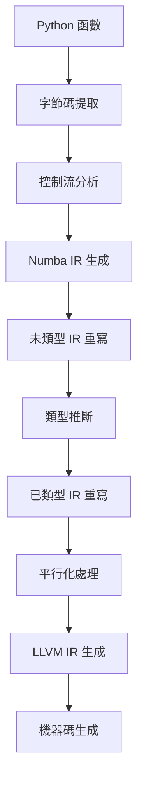

# numba/numba overview

[TOC]

## 請說明這專案,回答的輸出請用繁體中文及Markdown格式

# Numba 專案概述

Numba 是一個開源的即時編譯器（JIT Compiler），專門為 Python 設計，能夠將 Python 和 NumPy 代碼編譯成高效的機器碼 numba:3-14 。

## 專案核心特性

### Python 語言支援
Numba 支援 Python 語言的嚴格子集，專注於數值計算需求 numba:25-27 ：

**完全支援的建構**：
- 條件分支：`if..elif..else`
- 迴圈：`while`、`for..in`、`break`、`continue`
- 基本生成器：`yield`
- 斷言：`assert` numba:30-35 

**部分支援的建構**：
- 例外處理：`try..except`、`raise`、`else` 和 `finally`
- 上下文管理器：`with`（僅支援 `numba.objmode()`）
- 串列推導式 numba:37-46 

### 專案結構
Numba 專案包含以下主要組件 numba:1-6 ：

- **編譯器管線**：位於 `numba/core/compiler.py`，處理編譯流程和標誌
- **調度器**：`numba/core/dispatcher.py`，管理編譯函數的不同實現
- **類型推斷**：`numba/core/typeinfer.py`，執行類型推斷算法
- **中間表示**：`numba/core/ir.py`，定義 Numba IR 數據結構

### 標準庫支援
Numba 支援多個 Python 標準庫模組 numba:391-425 ：

- `math` 和 `cmath`：數學函數
- `heapq`：堆積佇列算法
- `random`：隨機數生成
- `operator`：算術和比較運算子

## 社群與貢獻

### 貢獻方式
Numba 歡迎各種形式的貢獻 numba:1-4 ：

- 回答問題（Discourse 論壇或 Gitter 聊天室）
- 審查 Pull Request
- 文檔改進
- 程式碼開發

### 溝通渠道
- **Discourse 論壇**：用於較長的討論和設計議題 numba:31-36 
- **Gitter 聊天室**：即時問答和互動幫助 numba:13-22 
- **GitHub Issue 追蹤器**：錯誤報告和功能請求 numba:51-63 

## 文檔系統

Numba 使用 Sphinx 建構文檔，文檔源碼位於 `docs/source/` 目錄 numba:456-472 。文檔配置在 `docs/source/conf.py` 中定義 numba:69-79 。

## 發布流程

Numba 有標準化的發布流程，通常與 llvmlite 同步發布 numba:4-9 。發布說明包含兩部分：
- 使用 `towncrier` 生成發布摘要
- 使用 `maint/gitlog2changelog.py` 生成 PR 和作者列表 numba:54-58 

## 版本管理

專案使用版本控制系統管理發布，版本資訊在文檔配置中定義 numba:77-79 。即將到來的變更記錄在 `docs/upcoming_changes/` 目錄中，使用新聞片段格式 numba:5-11 。

---

## Notes

Numba 是一個成熟的開源專案，由 Anaconda, Inc. 和其他貢獻者維護 numba:71-71 。專案專注於提升 Python 數值計算的性能，特別是與 NumPy 陣列操作相關的代碼。

Wiki pages you might want to explore:
- [Python Language Support (numba/numba)](/wiki/numba/numba#6)
### Citations
**File:** docs/source/reference/pysupported.rst (L3-14)
```text
=========================
Supported Python features
=========================

Apart from the :ref:`pysupported-language` part below, which applies to both
:term:`object mode` and :term:`nopython mode`, this page only lists the
features supported in :term:`nopython mode`.

.. warning::
    Numba behavior differs from Python semantics in some situations.  We
    strongly advise reviewing :ref:`pysemantics` to become familiar with these
    differences.
```
**File:** docs/source/reference/pysupported.rst (L25-27)
```text
Numba strives to support as much of the Python language as possible, but
some language features are not available inside Numba-compiled functions.
Below is a quick reference for the support level of Python constructs.
```
**File:** docs/source/reference/pysupported.rst (L30-35)
```text
**Supported** constructs:

- conditional branch: ``if .. elif .. else``
- loops: ``while``, ``for .. in``, ``break``, ``continue``
- basic generator: ``yield``
- assertion: ``assert``
```
**File:** docs/source/reference/pysupported.rst (L37-46)
```text
**Partially supported** constructs:

- exceptions: ``try .. except``, ``raise``, ``else`` and ``finally``
  (See details in this :ref:`section <pysupported-exception-handling>`)

- context manager:
  ``with`` (only support :ref:`numba.objmode() <with_objmode>`)

- list comprehension (see details in this
  :ref:`section <pysupported-comprehension>`)
```
**File:** docs/source/developer/repomap.rst (L1-6)
```text
A Map of the Numba Repository
=============================

The Numba repository is quite large, and due to age has functionality spread
around many locations.  To help orient developers, this document will try to
summarize where different categories of functionality can be found.
```
**File:** docs/source/developer/repomap.rst (L391-425)
```text
- :ghfile:`numba/cpython/cmathimpl.py` - Python complex math module
- :ghfile:`numba/cpython/enumimpl.py` - Enum objects
- :ghfile:`numba/cpython/hashing.py` - Hashing algorithms
- :ghfile:`numba/cpython/heapq.py` - Python ``heapq`` module
- :ghfile:`numba/cpython/iterators.py` - Iterable data types and iterators
- :ghfile:`numba/cpython/listobj.py` - Python lists
- :ghfile:`numba/cpython/mathimpl.py` - Python ``math`` module
- :ghfile:`numba/cpython/numbers.py` - Numeric values (int, float, etc)
- :ghfile:`numba/cpython/printimpl.py` - Print function
- :ghfile:`numba/cpython/randomimpl.py` - Python and NumPy ``random``
  modules
- :ghfile:`numba/cpython/rangeobj.py` - Python `range` objects
- :ghfile:`numba/cpython/slicing.py` - Slice objects, and index calculations
  used in slicing
- :ghfile:`numba/cpython/setobj.py` - Python set type
- :ghfile:`numba/cpython/tupleobj.py` - Tuples (statically typed as
  immutable struct)
- :ghfile:`numba/misc/cffiimpl.py` - CFFI functions
- :ghfile:`numba/misc/quicksort.py` - Quicksort implementation used with
  list and array objects
- :ghfile:`numba/misc/mergesort.py` - Mergesort implementation used with
  array objects
- :ghfile:`numba/np/arraymath.py` - Math operations on arrays (both
  Python and NumPy)
- :ghfile:`numba/np/arrayobj.py` - Array operations (both NumPy and
  buffer protocol)
- :ghfile:`numba/np/linalg.py` - NumPy linear algebra operations
- :ghfile:`numba/np/npdatetime.py` - NumPy datetime operations
- :ghfile:`numba/np/npyfuncs.py` - Kernels used in generating some
  NumPy ufuncs
- :ghfile:`numba/np/npyimpl.py` - Implementations of most NumPy ufuncs
- :ghfile:`numba/np/polynomial/polynomial_functions.py` - Implementations of NumPy ``Polynomial`` functions
- :ghfile:`numba/np/polynomial/polynomial_core.py` - Implementations of NumPy ``Polynomial`` class
- :ghfile:`numba/np/ufunc_db.py` - Big table mapping types to ufunc
  implementations
```
**File:** CONTRIBUTING.md (L1-4)
```markdown

We welcome people who want to make contributions to Numba, big or small!
Even simple documentation improvements are encouraged.

```
**File:** docs/source/developer/contributing.rst (L13-22)
```text
Real-time Chat
''''''''''''''

Numba uses Gitter for public real-time chat.  To help improve the
signal-to-noise ratio, we have two channels:

* `numba/numba <https://gitter.im/numba/numba>`_: General Numba discussion,
  questions, and debugging help.
* `numba/numba-dev <https://gitter.im/numba/numba-dev>`_: Discussion of PRs,
  planning, release coordination, etc.
```
**File:** docs/source/developer/contributing.rst (L31-36)
```text
Forum
.....

Numba uses Discourse as a forum for longer running threads such as design
discussions and roadmap planning. There are various categories available and it
can be reached at: `numba.discourse.group <https://numba.discourse.group/>`_.
```
**File:** docs/source/developer/contributing.rst (L51-63)
```text
Bug tracker
''''''''''''

We use the `Github issue tracker <https://github.com/numba/numba/issues>`_
to track both bug reports and feature requests.  If you report an issue,
please include specifics:

* what you are trying to do;
* which operating system you have and which version of Numba you are running;
* how Numba is misbehaving, e.g. the full error traceback, or the unexpected
  results you are getting;
* as far as possible, a code snippet that allows full reproduction of your
  problem.
```
**File:** docs/source/developer/contributing.rst (L456-472)
```text
Main documentation
''''''''''''''''''

This documentation is under the ``docs`` directory of the `Numba repository`_.
It is built with `Sphinx <http://sphinx-doc.org/>`_, `numpydoc
<https://numpydoc.readthedocs.io/>`_ and the
`sphinx-rtd-theme <https://sphinx-rtd-theme.readthedocs.io/en/stable/>`_.

To install all dependencies for building the documentation, use::

   $ conda install sphinx numpydoc sphinx_rtd_theme

You can edit the source files under ``docs/source/``, after which you can
build and check the documentation under ``docs/``::

   $ make html
   $ open _build/html/index.html
```
**File:** docs/source/conf.py (L69-79)
```python
# General information about the project.
project = u'Numba'
copyright = u'2012-2020, Anaconda, Inc. and others'

# The version info for the project you're documenting, acts as replacement for
# |version| and |release|, also used in various other places throughout the
# built documents.
#
version = '.'.join(numba.__version__.split('.')[:2])
# The full version, including alpha/beta/rc tags.
release = numba.__version__
```
**File:** docs/source/developer/release.rst (L4-9)
```text
The goal of the Numba release process -- from a high level perspective -- is to
publish source and binary artifacts that correspond to a given version
number. This usually involves a sequence of individual tasks that must be
performed in the correct order and with diligence. Numba and llvmlite are
commonly released in lockstep since there is usually a one-to-one mapping
between a Numba version and a corresponding llvmlite version.
```
**File:** docs/source/developer/release.rst (L54-58)
```text
The Numba release notes consist of two parts and there are two tools which need
to be invoked.

* Release summary and overview of noteworthy items: use ``towncrier``
* Pull-request and author list: use ``maint/gitlog2changelog.py``
```
**File:** docs/upcoming_changes/README.rst (L5-11)
```text
This directory contains "news fragments" which are short files that contain a
small **ReST**-formatted text that will be added to the next what's new page.

Make sure to use full sentences with correct case and punctuation, and please
try to use Sphinx intersphinx using backticks. The fragment should have a
header line and an underline using ``------`` followed by description of
your user-facing changes as they should appear in the release notes.
```
## 請說明這專案的程式架構與邏輯, 回答的輸出請用繁體中文及Markdown格式

# Numba 程式架構與邏輯

## 編譯器整體架構

Numba 採用經典的前端-後端編譯器架構，將 Python 字節碼轉換為高效的機器碼 numba:59-78 。

### 前端（Frontend）
前端負責分析 Python 字節碼並進行各種轉換：
- **字節碼分析**：解析 Python 字節碼，建立控制流圖（CFG） numba:112-124 
- **IR 生成**：將堆疊機器表示轉換為暫存器機器表示 numba:215-223 
- **類型推斷**：為每個中間變數推斷具體類型 numba:285-297 

### 後端（Backend）
後端利用類型資訊生成最終的機器碼：
- **LLVM IR 生成**：將 Numba IR 轉換為 LLVM IR numba:643-656 
- **程式碼優化**：使用 LLVM 進行優化
- **機器碼生成**：生成特定架構的機器碼 numba:885-894 

## 編譯流程詳解



### 階段 1：字節碼分析
Numba 首先提取 Python 函數的字節碼，並分析其控制流和數據流 numba:112-124 。

### 階段 2：Numba IR 生成
將 Python 字節碼轉換為 Numba 的中間表示（IR），從堆疊機器模型轉為暫存器機器模型 numba:215-244 。

### 階段 3：類型推斷
類型推斷引擎為 IR 中的每個變數推斷具體類型，這是生成高效程式碼的關鍵步驟 numba:285-297 。

### 階段 4：平行化處理（可選）
當啟用 `parallel=True` 時，Numba 會執行一系列平行化優化：
- **PreParforPass**：準備陣列操作 numba:27-35 
- **ParforPass**：將迴圈轉換為平行形式 numba:27-35 
- **ParforFusionPass**：合併相鄰的平行區域 numba:27-35 
- **ParforPreLoweringPass**：準備 lowering numba:27-35 

## 核心組件架構

### 編譯管線（Compiler Pipeline）
編譯管線由多個 pass 組成，每個 pass 負責特定的轉換或分析 numba:622-680 ：

```python
# 未類型管線
def define_untyped_pipeline(state, name='untyped'):
    pm = PassManager(name)
    pm.add_pass(TranslateByteCode, "analyzing bytecode")
    pm.add_pass(IRProcessing, "processing IR")
    pm.add_pass(WithLifting, "Handle with contexts")
    # ... 更多 pass
```

### 類型系統
Numba 的類型系統包含：
- **類型推斷**：`numba核心/typeinfer.py` numba:115-115 
- **類型定義**：`numba核心/types/` numba:154-156 
- **數據模型**：`numba核心/datamodel` numba:158-160 

### 調度系統
調度器（Dispatcher）管理編譯函數的不同實現，根據輸入類型選擇適當的編譯版本 numba:95-98 。

## 平行處理架構

### Parfor 系統
Parfor（Parallel For）是 Numba 平行處理的核心：
- **結構**：包含迴圈巢、初始化區塊、迴圈主體 numba:509-532 
- **轉換**：將標準迴圈轉換為可平行執行的形式
- **執行**：透過 gufunc 機制實現多執行緒執行

### 執行後端
Numba 支援多種執行後端：
- **TBB**：Intel 的 Thread Building Blocks
- **OpenMP**：標準平行程式設計 API
- **Workqueue**：Numba 內建的執行緒池實作

## 編譯模式

### Nopython Mode
生成不依賴 Python C API 的程式碼，提供最佳性能 numba:50-56 。

### Object Mode
處理所有值為 Python 物件，使用 Python C API 執行操作 numba:67-73 。

### Loop Lifting
在 object mode 中自動提取可編譯的迴圈並以 nopython mode 編譯 numba:36-44 。

---

## Notes

Numba 的架構設計充分利用了 LLVM 的優化能力，同時保持了與 Python 生態系統的相容性。編譯管線的模組化設計使得添加新的優化 pass 和支援新的硬體架構變得相對容易 numba:33-50 。

Wiki pages you might want to explore:
- [Parallel Computing (numba/numba)](/wiki/numba/numba#4)
### Citations
**File:** docs/source/developer/architecture.rst (L59-78)
```text
Compiler architecture
=====================

Like many compilers, Numba can be conceptually divided into a
*frontend* and a *backend*.

The Numba *frontend* comprises the stages which analyze the Python bytecode,
translate it to :term:`Numba IR` and perform various transformations and
analysis steps on the IR.  One of the key steps is :term:`type inference`.
The frontend must succeed in typing all variables unambiguously in order
for the backend to generate code in :term:`nopython mode`, because the
backend uses type information to match appropriate code generators with
the values they operate on.

The Numba *backend* walks the Numba IR resulting from the frontend analyses
and exploits the type information deduced by the type inference phase to
produce the right LLVM code for each encountered operation.  After LLVM
code is produced, the LLVM library is asked to optimize it and generate
native processor code for the final, native function.

```
**File:** docs/source/developer/architecture.rst (L112-124)
```text
Stage 1: Analyze bytecode
-------------------------

At the start of compilation, the function bytecode is passed to an instance of
the Numba interpreter (``numba.interpreter``).  The interpreter object
analyzes the bytecode to find the control flow graph (``numba.controlflow``).
The control flow graph (CFG) describes the ways that execution can move from one
block to the next inside the function as a result of loops and branches.

The data flow analysis (``numba.dataflow``) takes the control flow graph and
traces how values get pushed and popped off the Python interpreter stack for
different code paths.  This is important to understand the lifetimes of
variables on the stack, which are needed in Stage 2.
```
**File:** docs/source/developer/architecture.rst (L215-244)
```text
Stage 2: Generate the Numba IR
------------------------------

Once the control flow and data analyses are complete, the Numba interpreter
can step through the bytecode and translate it into an Numba-internal
intermediate representation.  This translation process changes the function
from a stack machine representation (used by the Python interpreter) to a
register machine representation (used by LLVM).

Although the IR is stored in memory as a tree of objects, it can be serialized
to a string for debugging.  If you set the environment variable
``NUMBA_DUMP_IR`` equal to 1, the Numba IR will be dumped to the screen.  For
the ``add()`` function described above, the Numba IR looks like::

   label 0:
       a = arg(0, name=a)                       ['a']
       b = arg(1, name=b)                       ['b']
       $0.3 = a + b                             ['$0.3', 'a', 'b']
       del b                                    []
       del a                                    []
       $0.4 = cast(value=$0.3)                  ['$0.3', '$0.4']
       del $0.3                                 []
       return $0.4                              ['$0.4']

The ``del`` instructions are produced by :ref:`live variable analysis`.
Those instructions ensure references are not leaked.
In :term:`nopython mode`, some objects are tracked by the Numba runtime and
some are not.  For tracked objects, a dereference operation is emitted;
otherwise, the instruction is an no-op.
In :term:`object mode` each variable contains an owned reference to a PyObject.
```
**File:** docs/source/developer/architecture.rst (L285-297)
```text
Stage 4: Infer types
--------------------

Now that the Numba IR has been generated, type analysis can be performed.  The
types of the function arguments can be taken either from the explicit function
signature given in the ``@jit`` decorator (such as ``@jit('float64(float64,
float64)')``), or they can be taken from the types of the actual function
arguments if compilation is happening when the function is first called.

The type inference engine is found in ``numba.typeinfer``.  Its job is to
assign a type to every intermediate variable in the Numba IR.  The result of
this pass can be seen by setting the :envvar:`NUMBA_DUMP_ANNOTATION`
environment variable to 1:
```
**File:** docs/source/developer/architecture.rst (L643-656)
```text
Stage 6a: Generate nopython LLVM IR
-----------------------------------

If type inference succeeds in finding a Numba type for every intermediate
variable, then Numba can (potentially) generate specialized native code.  This
process is called :term:`lowering`.  The Numba IR tree is translated into
LLVM IR by using helper classes from `llvmlite <http://llvmlite.pydata.org/>`_.
The machine-generated LLVM IR can seem unnecessarily verbose, but the LLVM
toolchain is able to optimize it quite easily into compact, efficient code.

The basic lowering algorithm is generic, but the specifics of how particular
Numba IR nodes are translated to LLVM instructions is handled by the
target context selected for compilation.  The default target context is
the "cpu" context, defined in ``numba.targets.cpu``.
```
**File:** docs/source/developer/architecture.rst (L885-894)
```text
Stage 7: Compile LLVM IR to machine code
----------------------------------------

In both :term:`object mode` and :term:`nopython mode`, the generated LLVM IR
is compiled by the LLVM JIT compiler and the machine code is loaded into
memory.  A Python wrapper is also created (defined in
``numba.dispatcher.Dispatcher``) which can do the dynamic dispatch to the
correct version of the compiled function if multiple type specializations
were generated (for example, for both ``float32`` and ``float64`` versions
of the same function).
```
**File:** numba/core/compiler.py (L27-35)
```python
from numba.core.typed_passes import (NopythonTypeInference, AnnotateTypes,
                                     NopythonRewrites, PreParforPass,
                                     ParforPass, DumpParforDiagnostics,
                                     IRLegalization, NoPythonBackend,
                                     InlineOverloads, PreLowerStripPhis,
                                     NativeLowering, NativeParforLowering,
                                     NoPythonSupportedFeatureValidation,
                                     ParforFusionPass, ParforPreLoweringPass
                                     )
```
**File:** numba/core/compiler.py (L622-680)
```python
    @staticmethod
    def define_parfor_gufunc_pipeline(state, name="parfor_gufunc_typed"):
        """Returns the typed part of the nopython pipeline"""
        pm = PassManager(name)
        assert state.func_ir
        pm.add_pass(IRProcessing, "processing IR")
        pm.add_pass(NopythonTypeInference, "nopython frontend")
        pm.add_pass(ParforPreLoweringPass, "parfor prelowering")

        pm.finalize()
        return pm

    @staticmethod
    def define_untyped_pipeline(state, name='untyped'):
        """Returns an untyped part of the nopython pipeline"""
        pm = PassManager(name)
        if state.func_ir is None:
            pm.add_pass(TranslateByteCode, "analyzing bytecode")
            pm.add_pass(FixupArgs, "fix up args")
        pm.add_pass(IRProcessing, "processing IR")
        pm.add_pass(WithLifting, "Handle with contexts")

        # inline closures early in case they are using nonlocal's
        # see issue #6585.
        pm.add_pass(InlineClosureLikes,
                    "inline calls to locally defined closures")

        # pre typing
        if not state.flags.no_rewrites:
            pm.add_pass(RewriteSemanticConstants, "rewrite semantic constants")
            pm.add_pass(DeadBranchPrune, "dead branch pruning")
            pm.add_pass(GenericRewrites, "nopython rewrites")

        pm.add_pass(RewriteDynamicRaises, "rewrite dynamic raises")

        # convert any remaining closures into functions
        pm.add_pass(MakeFunctionToJitFunction,
                    "convert make_function into JIT functions")
        # inline functions that have been determined as inlinable and rerun
        # branch pruning, this needs to be run after closures are inlined as
        # the IR repr of a closure masks call sites if an inlinable is called
        # inside a closure
        pm.add_pass(InlineInlinables, "inline inlinable functions")
        if not state.flags.no_rewrites:
            pm.add_pass(DeadBranchPrune, "dead branch pruning")

        pm.add_pass(FindLiterallyCalls, "find literally calls")
        pm.add_pass(LiteralUnroll, "handles literal_unroll")

        if state.flags.enable_ssa:
            pm.add_pass(ReconstructSSA, "ssa")

        if not state.flags.no_rewrites:
            pm.add_pass(DeadBranchPrune, "dead branch pruning")

        pm.add_pass(LiteralPropagationSubPipelinePass, "Literal propagation")

        pm.finalize()
        return pm
```
**File:** docs/source/developer/repomap.rst (L95-98)
```text
- :ghfile:`numba/core/dispatcher.py` - Dispatcher objects are compiled functions
  produced by ``@jit``.  A dispatcher has different implementations
  for different type signatures.
- :ghfile:`numba/_dispatcher.cpp` - C++ dispatcher implementation (for speed on
```
**File:** docs/source/developer/repomap.rst (L115-115)
```text
- :ghfile:`numba/core/typeinfer.py` - Type inference algorithm
```
**File:** docs/source/developer/repomap.rst (L154-156)
```text
- :ghfile:`numba/core/types/` - definition of the Numba type hierarchy, used
  everywhere in compiler to select implementations
- :ghfile:`numba/core/consts.py` - Constant inference (used to make constant
```
**File:** docs/source/developer/repomap.rst (L158-160)
```text
- :ghfile:`numba/core/datamodel` - LLVM IR representations of data types in
  different contexts
- :ghfile:`numba/core/datamodel/models.py` - Models for most standard types
```
**File:** numba/tests/test_parfors.py (L509-532)
```python
    preparfor_pass = numba.parfors.parfor.PreParforPass(
        tp.state.func_ir, tp.state.typemap, tp.state.calltypes,
        tp.state.typingctx, tp.state.targetctx, options,
        swapped=diagnostics.replaced_fns)
    preparfor_pass.run()

    rewrites.rewrite_registry.apply('after-inference', tp.state)

    flags = compiler.Flags()
    parfor_pass = numba.parfors.parfor.ParforPass(
        tp.state.func_ir, tp.state.typemap, tp.state.calltypes,
        tp.state.return_type, tp.state.typingctx, tp.state.targetctx,
        options, flags, tp.state.metadata, diagnostics=diagnostics)
    parfor_pass.run()
    parfor_pass = numba.parfors.parfor.ParforFusionPass(
        tp.state.func_ir, tp.state.typemap, tp.state.calltypes,
        tp.state.return_type, tp.state.typingctx, tp.state.targetctx,
        options, flags, tp.state.metadata, diagnostics=diagnostics)
    parfor_pass.run()
    parfor_pass = numba.parfors.parfor.ParforPreLoweringPass(
        tp.state.func_ir, tp.state.typemap, tp.state.calltypes,
        tp.state.return_type, tp.state.typingctx, tp.state.targetctx,
        options, flags, tp.state.metadata, diagnostics=diagnostics)
    parfor_pass.run()
```
**File:** docs/source/glossary.rst (L36-44)
```text
   lifted loops
   loop-lifting
   loop-jitting
      A feature of compilation in :term:`object mode` where a loop can be
      automatically extracted and compiled in :term:`nopython mode`.  This
      allows functions with operations unsupported in nopython mode to see
      significant performance improvements if they contain loops with only
      nopython-supported operations.

```
**File:** docs/source/glossary.rst (L50-56)
```text
   NPM
   nopython mode
      A Numba compilation mode that generates code that does not access the
      Python C API.  This compilation mode produces the highest performance
      code, but requires that the native types of all values in the function
      can be :term:`inferred <type inference>`.

```
**File:** docs/source/glossary.rst (L67-73)
```text
   object mode
      A Numba compilation mode that generates code that handles all values
      as Python objects and uses the Python C API to perform all operations
      on those objects.  Code compiled in object mode will often run
      no faster than Python interpreted code, unless the Numba compiler can
      take advantage of :term:`loop-jitting`.

```
**File:** docs/source/developer/custom_pipeline.rst (L33-50)
```text
Numba makes it possible to implement a new compiler pass and does so through the
use of an API similar to that of LLVM. The following demonstrates the basic
process involved.


Compiler pass classes
#####################

All passes must inherit from ``numba.compiler_machinery.CompilerPass``, commonly
used subclasses are:

* ``numba.compiler_machinery.FunctionPass`` for describing a pass that operates
  on a function-at-once level and may mutate the IR state.
* ``numba.compiler_machinery.AnalysisPass`` for describing a pass that performs
  analysis only.
* ``numba.compiler_machinery.LoweringPass`` for describing a pass that performs
  lowering only.

```
## 如何列出支援的GPU 型號 ,本地 GPU 能力, 內存及功耗,頻寬, 並給出如何監控的範例, 回答的輸出請用繁體中文及Markdown格式

# Numba CUDA GPU 設備檢測與監控

## 快速總結

Numba 提供了完整的 CUDA GPU 設備檢測和監控功能，包括設備列表、計算能力、內存資訊等。主要通過 `numba.cuda.detect()` 和 `numba.cuda.list_devices()` 函數實現。

## 設備檢測與列出

### 基本設備檢測

使用 `numba.cuda.detect()` 函數可以檢測所有支援的 CUDA 設備並顯示詳細資訊 numba:463-501 ：

```python
from numba import cuda

# 檢測並顯示所有 CUDA 設備
cuda.detect()
```

### 獲取設備列表

使用 `numba.cuda.list_devices()` 獲取所有檢測到的設備列表 numba:446-448 ：

```python
from numba import cuda

# 獲取所有設備
devices = cuda.list_devices()
print(f"找到 {len(devices)} 個 CUDA 設備")

for i, device in enumerate(devices):
    print(f"設備 {i}: {device.name}")
```

## 詳細設備資訊

### 設備屬性查詢

每個設備物件包含詳細的屬性資訊 numba:548-617 ：

```python
from numba import cuda

# 獲取當前設備
device = cuda.get_current_device()

# 基本資訊
print(f"設備名稱: {device.name}")
print(f"設備 ID: {device.id}")
print(f"計算能力: {device.compute_capability}")
print(f"UUID: {device.uuid}")

# PCI 資訊
print(f"PCI 設備 ID: {device.PCI_DEVICE_ID}")
print(f"PCI 匯流排 ID: {device.PCI_BUS_ID}")

# 性能相關
print(f"核心執行超時: {'啟用' if device.KERNEL_EXEC_TIMEOUT else '停用'}")
print(f"FP32/FP64 性能比: {device.SINGLE_TO_DOUBLE_PRECISION_PERF_RATIO}")

# Windows 特定資訊
if hasattr(device, 'TCC_DRIVER'):
    print(f"計算模式: {'TCC' if device.TCC_DRIVER else 'WDDM'}")
```

### 內存資訊查詢

獲取設備內存資訊：

```python
from numba import cuda

# 獲取當前上下文
context = cuda.current_context()

# 查詢內存資訊
free_mem, total_mem = context.get_memory_info()
print(f"可用內存: {free_mem / 1024**3:.2f} GB")
print(f"總內存: {total_mem / 1024**3:.2f} GB")
print(f"使用率: {(1 - free_mem/total_mem) * 100:.1f}%")
```

## 系統資訊報告

### 完整系統資訊

使用 `numba -s` 命令或程式化方式獲取完整的系統資訊 numba:333-418 ：

```python
import numba
from numba.misc import numba_sysinfo

# 獲取系統資訊
sys_info = numba_sysinfo.get_sysinfo()

# 顯示 CUDA 相關資訊
print("=== CUDA 資訊 ===")
print(f"CUDA 設備已初始化: {sys_info.get('CUDA Device Initialized', 'N/A')}")
print(f"CUDA 驅動程式版本: {sys_info.get('CUDA Driver Version', 'N/A')}")
print(f"CUDA 執行時版本: {sys_info.get('CUDA Runtime Version', 'N/A')}")
print(f"NVIDIA 繫結可用: {sys_info.get('CUDA NVIDIA Bindings Available', 'N/A')}")
print(f"NVIDIA 繫結使用中: {sys_info.get('CUDA NVIDIA Bindings In Use', 'N/A')}")

# 顯示設備檢測輸出
if 'CUDA Detection Output' in sys_info:
    print("\n=== 設備檢測結果 ===")
    print(sys_info['CUDA Detection Output'])
```

## 監控範例

### 即時監控腳本

```python
import time
import psutil
from numba import cuda

def monitor_gpu(interval=5, duration=60):
    """監控 GPU 狀態"""
    start_time = time.time()
    
    while time.time() - start_time < duration:
        print(f"\n=== {time.strftime('%Y-%m-%d %H:%M:%S')} ===")
        
        # GPU 資訊
        if cuda.is_available():
            context = cuda.current_context()
            free_mem, total_mem = context.get_memory_info()
            device = cuda.get_current_device()
            
            print(f"GPU: {device.name}")
            print(f"計算能力: {device.compute_capability}")
            print(f"內存使用: {(1 - free_mem/total_mem) * 100:.1f}%")
            print(f"可用內存: {free_mem / 1024**3:.2f} GB / {total_mem / 1024**3:.2f} GB")
        else:
            print("CUDA 不可用")
        
        # CPU 資訊
        cpu_percent = psutil.cpu_percent(interval=1)
        memory = psutil.virtual_memory()
        
        print(f"CPU 使用率: {cpu_percent:.1f}%")
        print(f"系統內存使用: {memory.percent:.1f}%")
        print(f"可用系統內存: {memory.available / 1024**3:.2f} GB")
        
        time.sleep(interval)

# 執行監控
if __name__ == "__main__":
    monitor_gpu(interval=5, duration=60)
```

### 設備能力檢查

```python
from numba import cuda

def check_device_capabilities():
    """檢查設備能力"""
    if not cuda.is_available():
        print("未找到 CUDA 設備")
        return
    
    devices = cuda.list_devices()
    
    for i, device in enumerate(devices):
        print(f"\n=== 設備 {i}: {device.name} ===")
        
        # 檢查計算能力
        cc = device.compute_capability
        print(f"計算能力: {cc[0]}.{cc[1]}")
        
        # 檢查支援狀態
        if cc < (3, 5):
            print("狀態: 不支援 (CC < 3.5)")
        elif cc < (5, 0):
            print("狀態: 支援但已棄用")
        else:
            print("狀態: 完全支援")
        
        # 檢查特殊功能
        try:
            print(f"FP16 支援: {device.supports_float16}")
        except AttributeError:
            print("FP16 支援: 未知")
        
        # 顯示 UUID
        print(f"UUID: {device.uuid}")

check_device_capabilities()
```

## 環境變數配置

相關的環境變數可用於控制 CUDA 行為 numba:19-33 ：

```bash
# 使用 NVIDIA Python 繫結
export NUMBA_CUDA_USE_NVIDIA_BINDING=1

# 啟用次要版本相容性
export NUMBA_CUDA_ENABLE_MINOR_VERSION_COMPATIBILITY=1

# 預設 PTX 計算能力
export NUMBA_CUDA_DEFAULT_PTX_CC=7.5

# 啟用調試資訊
export NUMBA_CUDA_DEBUGINFO=1
```

---

## Notes

Numba 的 CUDA 支援需要正確安裝 CUDA 驅動程式和工具包。設備檢測功能會自動篩選不支援的 GPU（計算能力 < 3.5） numba:87-93 。對於生產環境，建議使用計算能力 5.0 或更高的設備以獲得最佳性能和支援。

Wiki pages you might want to explore:
- [CUDA GPU Support (numba/numba)](/wiki/numba/numba#5)
### Citations
**File:** numba/cuda/api.py (L446-448)
```python
def list_devices():
    "Return a list of all detected devices"
    return devices.gpus
```
**File:** numba/cuda/api.py (L463-501)
```python
def detect():
    """
    Detect supported CUDA hardware and print a summary of the detected hardware.

    Returns a boolean indicating whether any supported devices were detected.
    """
    devlist = list_devices()
    print('Found %d CUDA devices' % len(devlist))
    supported_count = 0
    for dev in devlist:
        attrs = []
        cc = dev.compute_capability
        kernel_timeout = dev.KERNEL_EXEC_TIMEOUT
        tcc = dev.TCC_DRIVER
        fp32_to_fp64_ratio = dev.SINGLE_TO_DOUBLE_PRECISION_PERF_RATIO
        attrs += [('Compute Capability', '%d.%d' % cc)]
        attrs += [('PCI Device ID', dev.PCI_DEVICE_ID)]
        attrs += [('PCI Bus ID', dev.PCI_BUS_ID)]
        attrs += [('UUID', dev.uuid)]
        attrs += [('Watchdog', 'Enabled' if kernel_timeout else 'Disabled')]
        if os.name == "nt":
            attrs += [('Compute Mode', 'TCC' if tcc else 'WDDM')]
        attrs += [('FP32/FP64 Performance Ratio', fp32_to_fp64_ratio)]
        if cc < (3, 5):
            support = '[NOT SUPPORTED: CC < 3.5]'
        elif cc < (5, 0):
            support = '[SUPPORTED (DEPRECATED)]'
            supported_count += 1
        else:
            support = '[SUPPORTED]'
            supported_count += 1

        print('id %d    %20s %40s' % (dev.id, dev.name, support))
        for key, val in attrs:
            print('%40s: %s' % (key, val))

    print('Summary:')
    print('\t%d/%d devices are supported' % (supported_count, len(devlist)))
    return supported_count > 0
```
**File:** numba/cuda/cudadrv/driver.py (L548-617)
```python
    """
    The device object owns the CUDA contexts.  This is owned by the driver
    object.  User should not construct devices directly.
    """
    @classmethod
    def from_identity(self, identity):
        """Create Device object from device identity created by
        ``Device.get_device_identity()``.
        """
        for devid in range(driver.get_device_count()):
            d = driver.get_device(devid)
            if d.get_device_identity() == identity:
                return d
        else:
            errmsg = (
                "No device of {} is found. "
                "Target device may not be visible in this process."
            ).format(identity)
            raise RuntimeError(errmsg)

    def __init__(self, devnum):
        if USE_NV_BINDING:
            result = driver.cuDeviceGet(devnum)
            self.id = result
            got_devnum = int(result)
        else:
            result = c_int()
            driver.cuDeviceGet(byref(result), devnum)
            got_devnum = result.value
            self.id = got_devnum

        msg = f"Driver returned device {got_devnum} instead of {devnum}"
        if devnum != got_devnum:
            raise RuntimeError(msg)

        self.attributes = {}

        # Read compute capability
        self.compute_capability = (self.COMPUTE_CAPABILITY_MAJOR,
                                   self.COMPUTE_CAPABILITY_MINOR)

        # Read name
        bufsz = 128

        if USE_NV_BINDING:
            buf = driver.cuDeviceGetName(bufsz, self.id)
            name = buf.decode('utf-8').rstrip('\0')
        else:
            buf = (c_char * bufsz)()
            driver.cuDeviceGetName(buf, bufsz, self.id)
            name = buf.value

        self.name = name

        # Read UUID
        if USE_NV_BINDING:
            uuid = driver.cuDeviceGetUuid(self.id)
            uuid_vals = tuple(uuid.bytes)
        else:
            uuid = cu_uuid()
            driver.cuDeviceGetUuid(byref(uuid), self.id)
            uuid_vals = tuple(bytes(uuid))

        b = '%02x'
        b2 = b * 2
        b4 = b * 4
        b6 = b * 6
        fmt = f'GPU-{b4}-{b2}-{b2}-{b2}-{b6}'
        self.uuid = fmt % uuid_vals

```
**File:** numba/misc/numba_sysinfo.py (L333-418)
```python
    # Python locale
    # On MacOSX, getdefaultlocale can raise. Check again if Py > 3.7.5
    try:
        # If $LANG is unset, getdefaultlocale() can return (None, None), make
        # sure we can encode this as strings by casting explicitly.
        sys_info[_python_locale] = '.'.join([str(i) for i in
                                             locale.getdefaultlocale()])
    except Exception as e:
        _error_log.append(f'Error (locale): {e}')

    # CUDA information
    try:
        sys_info[_cu_target_impl] = cu.implementation
    except AttributeError:
        # On the offchance an out-of-tree target did not set the
        # implementation, we can try to continue
        pass

    try:
        cu.list_devices()[0]  # will a device initialise?
    except Exception as e:
        sys_info[_cu_dev_init] = False
        msg_not_found = "CUDA driver library cannot be found"
        msg_disabled_by_user = "CUDA is disabled"
        msg_end = " or no CUDA enabled devices are present."
        msg_generic_problem = "CUDA device initialisation problem."
        msg = getattr(e, 'msg', None)
        if msg is not None:
            if msg_not_found in msg:
                err_msg = msg_not_found + msg_end
            elif msg_disabled_by_user in msg:
                err_msg = msg_disabled_by_user + msg_end
            else:
                err_msg = msg_generic_problem + " Message:" + msg
        else:
            err_msg = msg_generic_problem + " " + str(e)
        # Best effort error report
        _warning_log.append("Warning (cuda): %s\nException class: %s" %
                            (err_msg, str(type(e))))
    else:
        try:
            sys_info[_cu_dev_init] = True

            output = StringIO()
            with redirect_stdout(output):
                cu.detect()
            sys_info[_cu_detect_out] = output.getvalue()
            output.close()

            cu_drv_ver = cudriver.get_version()
            cu_rt_ver = curuntime.get_version()
            sys_info[_cu_drv_ver] = '%s.%s' % cu_drv_ver
            sys_info[_cu_rt_ver] = '%s.%s' % cu_rt_ver

            output = StringIO()
            with redirect_stdout(output):
                cudadrv.libs.test()
            sys_info[_cu_lib_test] = output.getvalue()
            output.close()

            try:
                from cuda import cuda  # noqa: F401
                nvidia_bindings_available = True
            except ImportError:
                nvidia_bindings_available = False
            sys_info[_cu_nvidia_bindings] = nvidia_bindings_available

            nv_binding_used = bool(cudadrv.driver.USE_NV_BINDING)
            sys_info[_cu_nvidia_bindings_used] = nv_binding_used

            try:
                from ptxcompiler import compile_ptx  # noqa: F401
                from cubinlinker import CubinLinker  # noqa: F401
                sys_info[_cu_mvc_available] = True
            except ImportError:
                sys_info[_cu_mvc_available] = False

            sys_info[_cu_mvc_needed] = cu_rt_ver > cu_drv_ver
            sys_info[_cu_mvc_in_use] = bool(
                config.CUDA_ENABLE_MINOR_VERSION_COMPATIBILITY)
        except Exception as e:
            _warning_log.append(
                "Warning (cuda): Probing CUDA failed "
                "(device and driver present, runtime problem?)\n"
                f"(cuda) {type(e)}: {e}")

```
**File:** buildscripts/gpuci/build.sh (L19-33)
```shellscript
# Test with NVIDIA Bindings on CUDA 11.5
if [ $CUDA_TOOLKIT_VER == "11.5" ]
then
  export NUMBA_CUDA_USE_NVIDIA_BINDING=1;
else
  export NUMBA_CUDA_USE_NVIDIA_BINDING=0;
fi;

# Test with Minor Version Compatibility on CUDA 11.8
if [ $CUDA_TOOLKIT_VER == "11.8" ]
then
  export NUMBA_CUDA_ENABLE_MINOR_VERSION_COMPATIBILITY=1;
else
  export NUMBA_CUDA_ENABLE_MINOR_VERSION_COMPATIBILITY=0;
fi;
```
**File:** docs/source/cuda/overview.rst (L87-93)
```text
Supported GPUs
--------------

Numba supports CUDA-enabled GPUs with Compute Capability 3.5 or greater.
Support for devices with Compute Capability less than 5.0 is deprecated, and
will be removed in a future Numba release.

```
